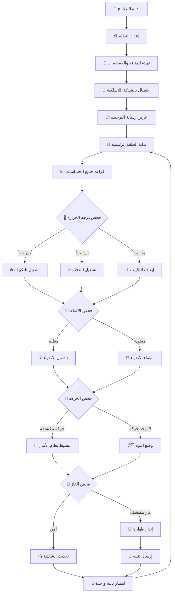
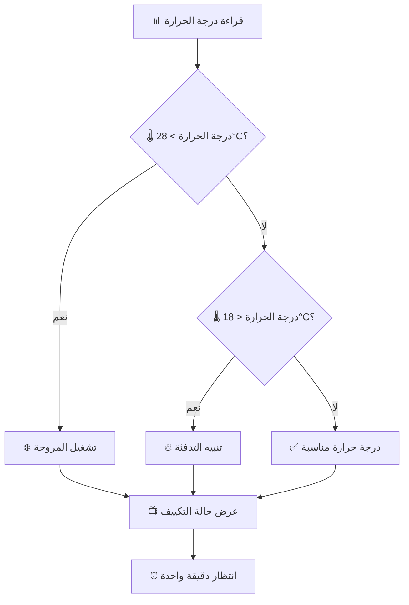
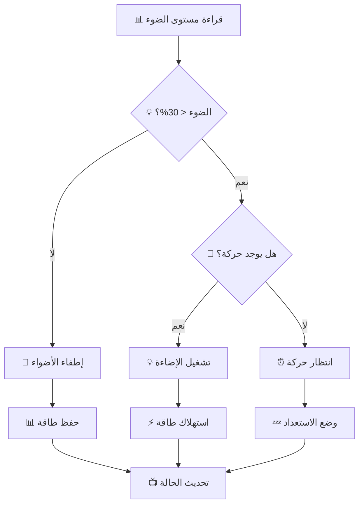
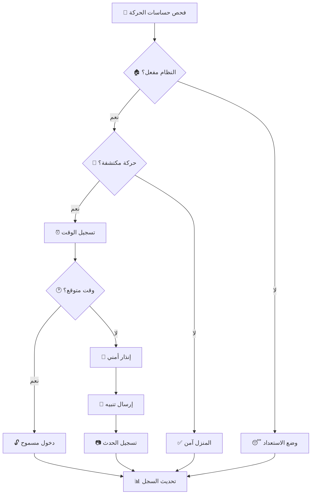
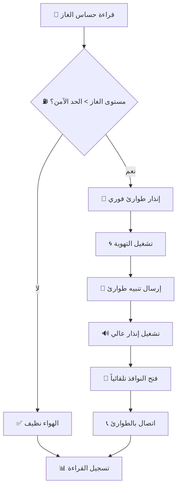
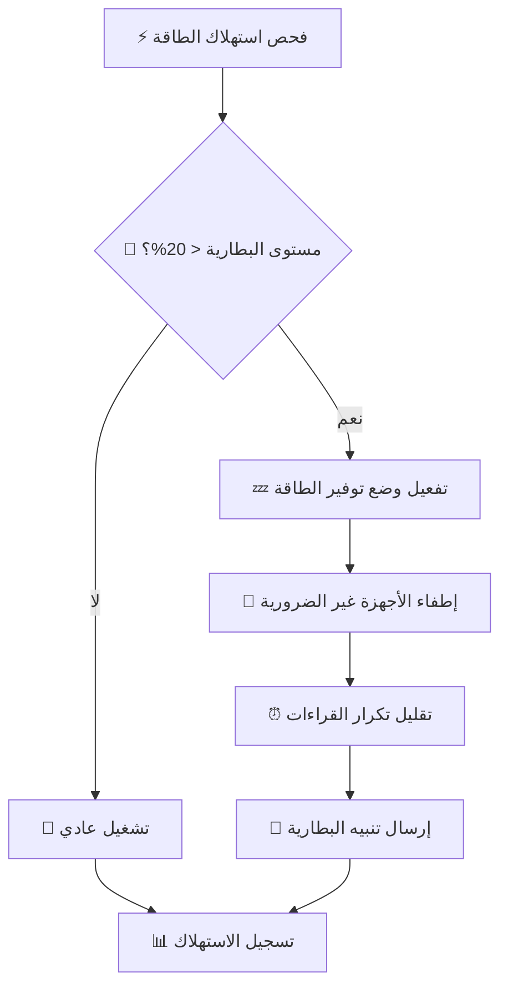

# 08 - مخطط تدفق البرنامج | Code Flowchart

## هيكل البرنامج العام 📊

### نظرة شاملة على منطق التشغيل 🔄



## تفصيل مراحل البرنامج 🔍

### المرحلة 1: إعداد النظام (Setup Phase) ⚙️

```cpp
void setup() {
    // 1. تهيئة التواصل التسلسلي
    Serial.begin(115200);
    Serial.println("🏠 مرحباً بكم في البيت الذكي!");
    
    // 2. إعداد منافذ الإدخال
    pinMode(PIR_PIN_1, INPUT);      // حساس الحركة 1
    pinMode(PIR_PIN_2, INPUT);      // حساس الحركة 2
    pinMode(LDR_PIN_1, INPUT);      // حساس الضوء 1
    pinMode(LDR_PIN_2, INPUT);      // حساس الضوء 2
    pinMode(GAS_PIN, INPUT);        // حساس الغاز
    
    // 3. إعداد منافذ الإخراج
    pinMode(LED_PIN_1, OUTPUT);     // مصباح 1
    pinMode(LED_PIN_2, OUTPUT);     // مصباح 2
    pinMode(BUZZER_PIN, OUTPUT);    // جهاز الإنذار
    pinMode(FAN_PIN, OUTPUT);       // المروحة
    
    // 4. تهيئة الحساسات
    dht.begin();                    // حساس الحرارة
    lcd.init();                     // الشاشة
    servo1.attach(SERVO_PIN_1);     // محرك 1
    servo2.attach(SERVO_PIN_2);     // محرك 2
    
    // 5. الاتصال بالواي فاي
    connectToWiFi();
    
    // 6. اختبار جميع المكونات
    testAllComponents();
    
    Serial.println("✅ تم تشغيل النظام بنجاح!");
}
```

### المرحلة 2: الحلقة الرئيسية (Main Loop) 🔄

```cpp
void loop() {
    // قراءة جميع الحساسات
    readAllSensors();
    
    // تحليل البيانات واتخاذ القرارات
    processTemperatureControl();
    processLightingControl();
    processSecuritySystem();
    processGasDetection();
    
    // تحديث المعلومات المعروضة
    updateDisplay();
    
    // إرسال البيانات عبر الشبكة
    sendDataToCloud();
    
    // انتظار قبل القراءة التالية
    delay(1000);
}
```

## خوارزميات الأنظمة الفرعية 🧠

### 1. نظام التحكم في درجة الحرارة 🌡️



**الكود المقابل:**
```cpp
void processTemperatureControl() {
    float temperature = dht.readTemperature();
    
    if (!isnan(temperature)) {
        if (temperature > TEMP_HIGH_THRESHOLD) {
            // تشغيل التبريد
            digitalWrite(FAN_PIN, HIGH);
            currentStatus.cooling = true;
            Serial.println("❄️ تم تشغيل التبريد");
            
        } else if (temperature < TEMP_LOW_THRESHOLD) {
            // إيقاف التبريد وتنبيه التدفئة
            digitalWrite(FAN_PIN, LOW);
            currentStatus.cooling = false;
            currentStatus.needHeating = true;
            Serial.println("🔥 الحاجة إلى تدفئة");
            
        } else {
            // درجة حرارة مناسبة
            digitalWrite(FAN_PIN, LOW);
            currentStatus.cooling = false;
            currentStatus.needHeating = false;
            Serial.println("✅ درجة حرارة مناسبة");
        }
        
        currentStatus.temperature = temperature;
    }
}
```

### 2. نظام الإضاءة الذكية 💡



**الكود المقابل:**
```cpp
void processLightingControl() {
    int lightLevel1 = analogRead(LDR_PIN_1);
    int lightLevel2 = analogRead(LDR_PIN_2);
    bool motion1 = digitalRead(PIR_PIN_1);
    bool motion2 = digitalRead(PIR_PIN_2);
    
    // تحويل القراءة إلى نسبة مئوية
    int lightPercent1 = map(lightLevel1, 0, 4095, 0, 100);
    int lightPercent2 = map(lightLevel2, 0, 4095, 0, 100);
    
    // غرفة المعيشة
    if (lightPercent1 < LIGHT_THRESHOLD && motion1) {
        digitalWrite(LED_PIN_1, HIGH);
        currentStatus.light1 = true;
        Serial.println("💡 تشغيل إضاءة غرفة المعيشة");
    } else if (lightPercent1 > LIGHT_THRESHOLD || !motion1) {
        digitalWrite(LED_PIN_1, LOW);
        currentStatus.light1 = false;
    }
    
    // المطبخ
    if (lightPercent2 < LIGHT_THRESHOLD && motion2) {
        digitalWrite(LED_PIN_2, HIGH);
        currentStatus.light2 = true;
        Serial.println("💡 تشغيل إضاءة المطبخ");
    } else if (lightPercent2 > LIGHT_THRESHOLD || !motion2) {
        digitalWrite(LED_PIN_2, LOW);
        currentStatus.light2 = false;
    }
    
    currentStatus.lightLevel1 = lightPercent1;
    currentStatus.lightLevel2 = lightPercent2;
}
```

### 3. نظام الأمان والمراقبة 🔒



**الكود المقابل:**
```cpp
void processSecuritySystem() {
    bool motion1 = digitalRead(PIR_PIN_1);
    bool motion2 = digitalRead(PIR_PIN_2);
    
    if (securitySystem.enabled) {
        if (motion1 || motion2) {
            unsigned long currentTime = millis();
            
            // فحص إذا كان التنبيه الأخير منذ أكثر من 30 ثانية
            if (currentTime - securitySystem.lastAlert > 30000) {
                securitySystem.lastAlert = currentTime;
                securitySystem.alertCount++;
                
                // تشغيل الإنذار
                activateAlarm();
                
                // إرسال تنبيه
                sendSecurityAlert(motion1 ? "غرفة المعيشة" : "المدخل");
                
                Serial.println("🚨 تم اكتشاف حركة غير مصرح بها!");
            }
        }
    }
    
    currentStatus.motion1 = motion1;
    currentStatus.motion2 = motion2;
}

void activateAlarm() {
    // تشغيل الجرس لمدة 3 ثوان
    digitalWrite(BUZZER_PIN, HIGH);
    delay(3000);
    digitalWrite(BUZZER_PIN, LOW);
    
    // وميض الأضواء
    for (int i = 0; i < 5; i++) {
        digitalWrite(LED_PIN_1, HIGH);
        digitalWrite(LED_PIN_2, HIGH);
        delay(200);
        digitalWrite(LED_PIN_1, LOW);
        digitalWrite(LED_PIN_2, LOW);
        delay(200);
    }
}
```

### 4. نظام كشف الغاز والطوارئ ⛽



**الكود المقابل:**
```cpp
void processGasDetection() {
    int gasLevel = analogRead(GAS_PIN);
    int gasPercent = map(gasLevel, 0, 4095, 0, 100);
    
    if (gasPercent > GAS_DANGER_THRESHOLD) {
        // حالة طوارئ
        emergencyProtocol();
        Serial.println("🚨 خطر! تم اكتشاف غاز!");
        
    } else if (gasPercent > GAS_WARNING_THRESHOLD) {
        // تحذير
        warningProtocol();
        Serial.println("⚠️ تحذير: مستوى غاز مرتفع");
        
    } else {
        // الوضع طبيعي
        currentStatus.gasAlert = false;
        Serial.println("✅ جودة الهواء جيدة");
    }
    
    currentStatus.gasLevel = gasPercent;
}

void emergencyProtocol() {
    currentStatus.gasAlert = true;
    
    // تشغيل التهوية الكاملة
    digitalWrite(FAN_PIN, HIGH);
    
    // فتح النوافذ (محركات Servo)
    servo1.write(90);  // فتح النافذة 1
    servo2.write(90);  // فتح النافذة 2
    
    // إنذار طوارئ
    for (int i = 0; i < 10; i++) {
        digitalWrite(BUZZER_PIN, HIGH);
        delay(200);
        digitalWrite(BUZZER_PIN, LOW);
        delay(200);
    }
    
    // إرسال تنبيه طوارئ
    sendEmergencyAlert("Gas Detection Alert!");
}
```

## إدارة البيانات والذاكرة 💾

### هيكل بيانات حالة النظام:

```cpp
struct SystemStatus {
    // بيانات الحساسات
    float temperature;
    float humidity;
    int lightLevel1;
    int lightLevel2;
    int gasLevel;
    bool motion1;
    bool motion2;
    
    // حالة الأجهزة
    bool light1;
    bool light2;
    bool cooling;
    bool needHeating;
    bool gasAlert;
    
    // إحصائيات
    unsigned long uptime;
    int alertCount;
    unsigned long lastUpdate;
};

SystemStatus currentStatus;
```

### نظام حفظ الطاقة 🔋



## خوارزمية التعلم الذكي 🤖

```cpp
void smartLearning() {
    // تعلم أنماط الاستخدام
    static int hourlyUsage[24] = {0};
    static int dailyPattern[7] = {0};
    
    int currentHour = hour();
    int currentDay = weekday();
    
    // تسجيل الاستخدام
    if (currentStatus.motion1 || currentStatus.motion2) {
        hourlyUsage[currentHour]++;
        dailyPattern[currentDay]++;
    }
    
    // تعديل حساسية النظام حسب الأنماط
    if (hourlyUsage[currentHour] > FREQUENT_USE_THRESHOLD) {
        // تقليل حساسية الإنذار في أوقات الاستخدام المتكرر
        securitySystem.sensitivity = LOW_SENSITIVITY;
    } else {
        // زيادة الحساسية في الأوقات غير المعتادة
        securitySystem.sensitivity = HIGH_SENSITIVITY;
    }
}
```

## نصائح لتحسين الأداء ⚡

### 1. تحسين سرعة التنفيذ:
- استخدم `millis()` بدلاً من `delay()` للعمليات غير المتزامنة
- اقرأ الحساسات بتكرار مناسب (لا تفرط)
- استخدم المقاطعات (Interrupts) للأحداث المهمة

### 2. توفير الذاكرة:
- استخدم المتغيرات بالحجم المناسب (`byte` بدلاً من `int` عند الإمكان)
- تجنب استخدام الـ `String` كثيراً، استخدم `char arrays`
- امسح البيانات القديمة بانتظام

### 3. الموثوقية:
- أضف فحص الأخطاء لجميع قراءات الحساسات
- استخدم نظام إعادة التشغيل التلقائي عند الأخطاء الخطيرة
- احفظ البيانات المهمة في الذاكرة غير المتطايرة

تذكروا: البرمجة الجيدة تحتاج إلى تخطيط دقيق واختبار شامل! 🎯💻 