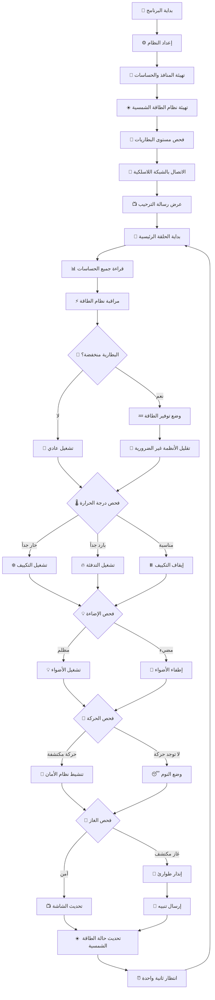
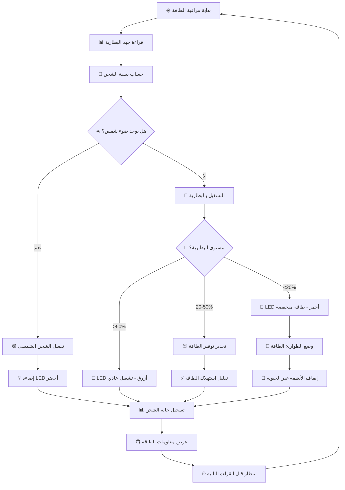
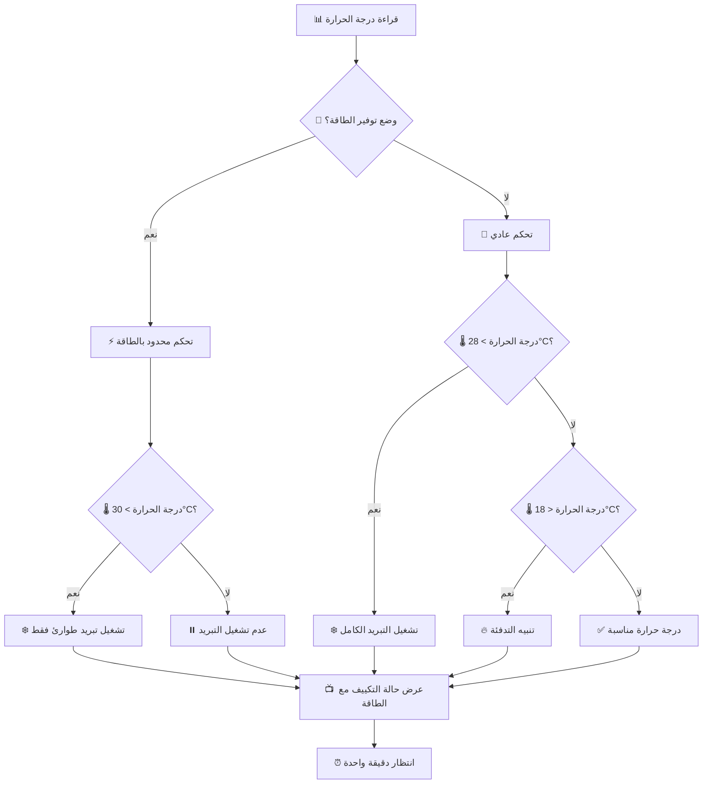
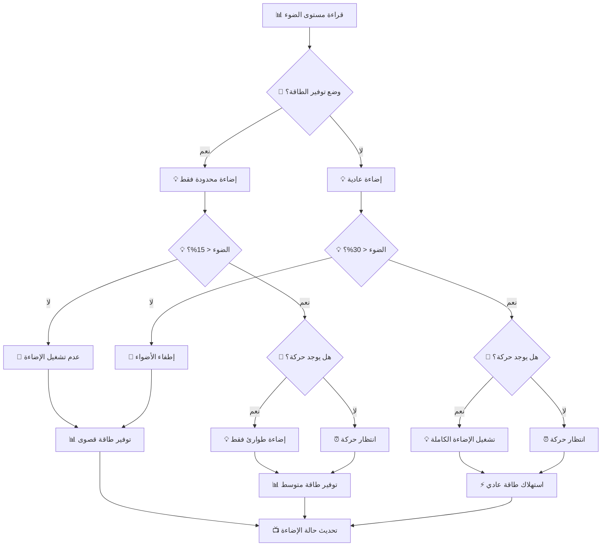
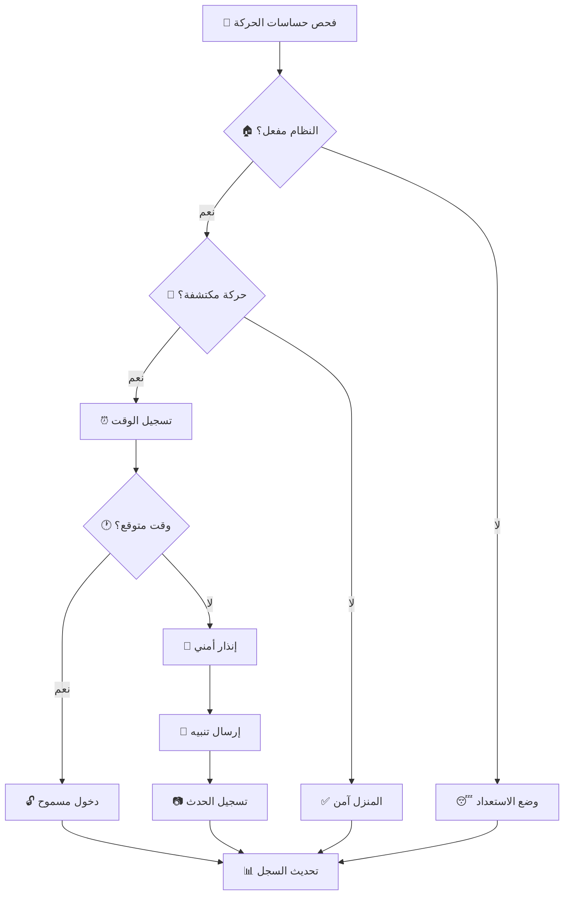
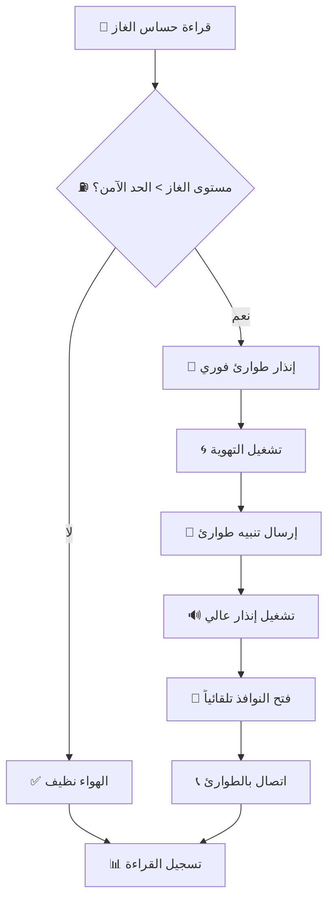
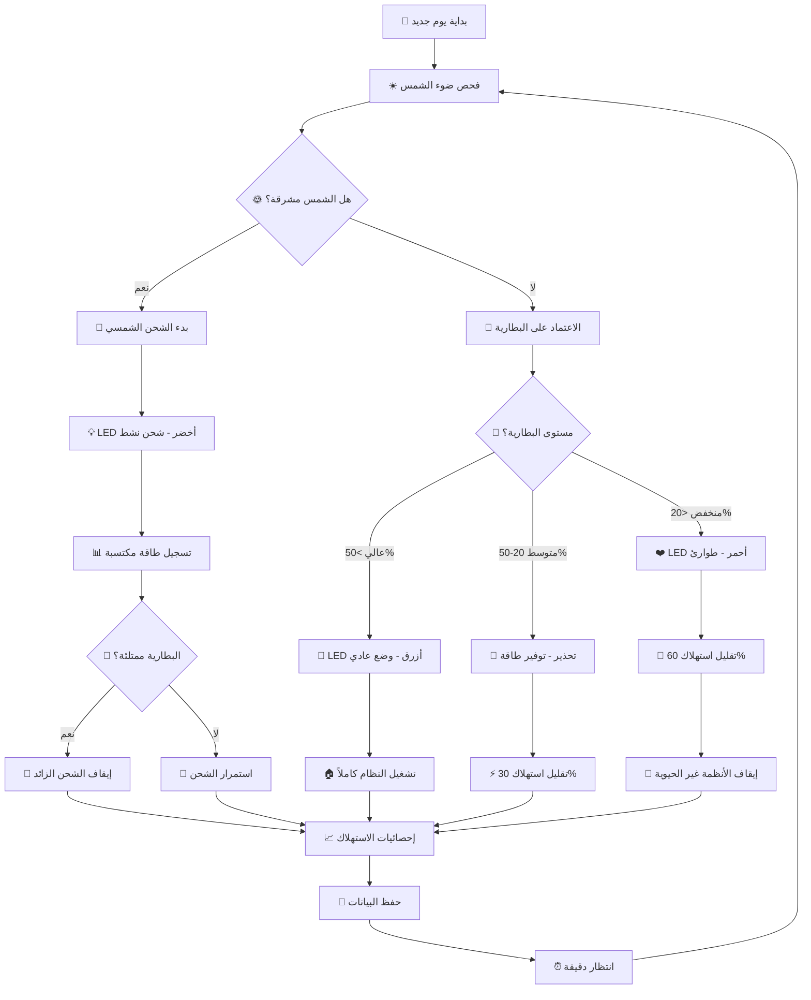
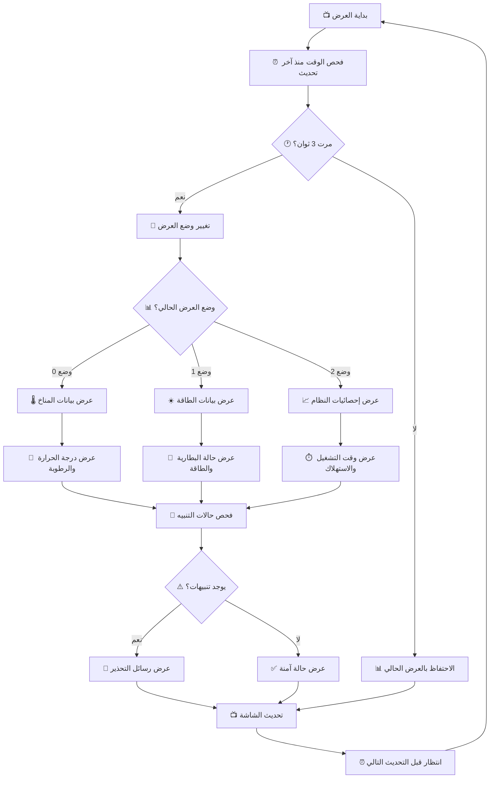

# 08 - مخطط تدفق البرنامج | Code Flowchart

## هيكل البرنامج العام مع نظام الطاقة الشمسية 📊☀️

### نظرة شاملة على منطق التشغيل المحدث 🔄



## تفصيل مراحل البرنامج المحدث 🔍

### المرحلة 1: إعداد النظام مع الطاقة الشمسية (Setup Phase) ⚙️☀️

```cpp
void setup() {
    // 1. تهيئة التواصل التسلسلي
    Serial.begin(115200);
    Serial.println("🏠☀️ مرحباً بكم في البيت الذكي البيئي!");
    
    // 2. إعداد منافذ الإدخال
    pinMode(PIR_PIN_1, INPUT);      // حساس الحركة 1
    pinMode(PIR_PIN_2, INPUT);      // حساس الحركة 2
    pinMode(LDR_PIN_1, INPUT);      // حساس الضوء 1
    pinMode(LDR_PIN_2, INPUT);      // حساس الضوء 2
    pinMode(GAS_PIN, INPUT);        // حساس الغاز
    pinMode(VOLTAGE_SENSOR_PIN, INPUT); // حساس مستوى البطارية
    
    // 3. إعداد منافذ الإخراج
    pinMode(LED_PIN_1, OUTPUT);     // مصباح 1
    pinMode(LED_PIN_2, OUTPUT);     // مصباح 2
    pinMode(BUZZER_PIN, OUTPUT);    // جهاز الإنذار
    pinMode(FAN_PIN, OUTPUT);       // المروحة
    
    // 4. إعداد مؤشرات نظام الطاقة الشمسية
    pinMode(SOLAR_LED_PIN, OUTPUT);    // مؤشر الطاقة الشمسية
    pinMode(BATTERY_LED_PIN, OUTPUT);  // مؤشر البطارية المنخفضة
    pinMode(SYSTEM_LED_PIN, OUTPUT);   // مؤشر حالة النظام
    
    // 5. تهيئة الحساسات
    dht.begin();                    // حساس الحرارة
    lcd.init();                     // الشاشة
    servo1.attach(SERVO_PIN_1);     // محرك 1
    servo2.attach(SERVO_PIN_2);     // محرك 2
    
    // 6. تهيئة نظام الطاقة الشمسية
    initializePowerSystem();
    
    // 7. الاتصال بالواي فاي
    connectToWiFi();
    
    // 8. اختبار جميع المكونات
    testAllComponents();
    
    Serial.println("✅ تم تشغيل النظام بنجاح مع الطاقة الشمسية!");
}
```

### المرحلة 2: الحلقة الرئيسية المحدثة (Main Loop) 🔄

```cpp
void loop() {
    // قراءة جميع الحساسات
    readAllSensors();
    
    // مراقبة وإدارة نظام الطاقة الشمسية (أولوية عليا)
    readBatteryStatus();
    processPowerManagement();
    
    // تحليل البيانات واتخاذ القرارات
    processTemperatureControl();
    processLightingControl();
    processSecuritySystem();
    processGasDetection();
    
    // تحديث المعلومات المعروضة
    updateDisplay();
    
    // إرسال البيانات عبر الشبكة
    sendDataToCloud();
    
    // تسجيل بيانات الطاقة الشمسية
    solarDataLogging();
    
    // انتظار قبل القراءة التالية
    delay(1000);
}
```

## خوارزميات الأنظمة الفرعية المحدثة 🧠

### 1. نظام الطاقة الشمسية وإدارة البطاريات ☀️🔋



**الكود المقابل:**
```cpp
void processPowerManagement() {
    // قراءة جهد البطارية
    readBatteryStatus();
    
    // إدارة مؤشرات LED للطاقة
    if (homeStatus.solarCharging) {
        // الطاقة الشمسية متوفرة - LED أخضر
        digitalWrite(SOLAR_LED_PIN, HIGH);
        digitalWrite(BATTERY_LED_PIN, LOW);
        digitalWrite(SYSTEM_LED_PIN, LOW);
        homeStatus.powerSource = "شمسي";
        
    } else if (homeStatus.batteryPercentage > 20) {
        // يعمل بالبطارية - LED أزرق
        digitalWrite(SYSTEM_LED_PIN, HIGH);
        digitalWrite(BATTERY_LED_PIN, LOW);
        digitalWrite(SOLAR_LED_PIN, LOW);
        homeStatus.powerSource = "بطارية";
        
    } else {
        // بطارية منخفضة - LED أحمر يرمش
        static unsigned long lastBlink = 0;
        if (millis() - lastBlink > 500) {
            lastBlink = millis();
            digitalWrite(BATTERY_LED_PIN, !digitalRead(BATTERY_LED_PIN));
        }
        digitalWrite(SOLAR_LED_PIN, LOW);
        digitalWrite(SYSTEM_LED_PIN, LOW);
        homeStatus.powerSource = "طوارئ";
    }
    
    // تفعيل وضع توفير الطاقة عند الحاجة
    if (homeStatus.lowBattery) {
        energySavingMode();
    }
}

void readBatteryStatus() {
    // قراءة جهد البطارية عبر مقسم الجهد
    int voltageReading = analogRead(VOLTAGE_SENSOR_PIN);
    homeStatus.batteryVoltage = (voltageReading * 3.3 / 4095) * 2.0;
    
    // حساب نسبة الشحن (16.8V = 100%, 12.4V = 0%)
    homeStatus.batteryPercentage = map(homeStatus.batteryVoltage * 100, 1240, 1680, 0, 100);
    homeStatus.batteryPercentage = constrain(homeStatus.batteryPercentage, 0, 100);
    
    // تحديد حالة البطارية
    homeStatus.lowBattery = (homeStatus.batteryPercentage < 20);
    homeStatus.solarCharging = (homeStatus.batteryVoltage > 15.5);
}

void energySavingMode() {
    static bool energyModeActive = false;
    
    if (!energyModeActive) {
        energyModeActive = true;
        Serial.println("🔋 تفعيل وضع توفير الطاقة!");
        
        // تقليل سطوع الإضاءة أو إيقافها
        digitalWrite(LED_PIN_1, LOW);
        digitalWrite(LED_PIN_2, LOW);
        
        // إيقاف المراوح غير الضرورية
        if (!homeStatus.gasAlert) {
            digitalWrite(FAN_PIN, LOW);
        }
    }
    
    // إنذار البطارية المنخفضة
    static unsigned long lastWarning = 0;
    if (millis() - lastWarning > 30000) {
        lastWarning = millis();
        lowBatteryAlert();
    }
}
```

### 2. نظام التحكم في درجة الحرارة مع إدارة الطاقة 🌡️



**الكود المحدث:**
```cpp
void processTemperatureControl() {
    float temperature = dht.readTemperature();
    
    if (!isnan(temperature)) {
        // فحص وضع توفير الطاقة أولاً
        if (homeStatus.lowBattery) {
            // في وضع توفير الطاقة - تبريد طوارئ فقط
            if (temperature > 30.0) {
                digitalWrite(FAN_PIN, HIGH);
                homeStatus.cooling = true;
                Serial.println("❄️ تبريد طوارئ - بطارية منخفضة");
            } else {
                digitalWrite(FAN_PIN, LOW);
                homeStatus.cooling = false;
            }
        } else {
            // تشغيل عادي
            if (temperature > TEMP_HIGH_THRESHOLD) {
                digitalWrite(FAN_PIN, HIGH);
                homeStatus.cooling = true;
                Serial.println("❄️ تم تشغيل التبريد");
                
            } else if (temperature < TEMP_LOW_THRESHOLD) {
                digitalWrite(FAN_PIN, LOW);
                homeStatus.cooling = false;
                homeStatus.needHeating = true;
                Serial.println("🔥 الحاجة إلى تدفئة");
                
            } else {
                digitalWrite(FAN_PIN, LOW);
                homeStatus.cooling = false;
                homeStatus.needHeating = false;
                Serial.println("✅ درجة حرارة مناسبة");
            }
        }
        
        homeStatus.temperature = temperature;
    }
}
```

### 3. نظام الإضاءة الذكية مع كفاءة الطاقة 💡



**الكود المحدث:**
```cpp
void processLightingControl() {
    int lightLevel1 = analogRead(LDR_PIN_1);
    int lightLevel2 = analogRead(LDR_PIN_2);
    bool motion1 = digitalRead(PIR_PIN_1);
    bool motion2 = digitalRead(PIR_PIN_2);
    
    // تحويل القراءة إلى نسبة مئوية
    int lightPercent1 = map(lightLevel1, 0, 4095, 0, 100);
    int lightPercent2 = map(lightLevel2, 0, 4095, 0, 100);
    
    // تحديد عتبة الإضاءة حسب حالة البطارية
    int lightThreshold = homeStatus.lowBattery ? 15 : LIGHT_THRESHOLD;
    
    // غرفة المعيشة
    if (homeStatus.lowBattery) {
        // في وضع توفير الطاقة - إضاءة محدودة فقط
        if (lightPercent1 < lightThreshold && motion1) {
            digitalWrite(LED_PIN_1, HIGH);
            homeStatus.light1 = true;
            Serial.println("💡 إضاءة طوارئ - غرفة المعيشة");
        } else {
            digitalWrite(LED_PIN_1, LOW);
            homeStatus.light1 = false;
        }
    } else {
        // تشغيل عادي
        if (lightPercent1 < lightThreshold && motion1) {
            digitalWrite(LED_PIN_1, HIGH);
            homeStatus.light1 = true;
            Serial.println("💡 تشغيل إضاءة غرفة المعيشة");
        } else {
            digitalWrite(LED_PIN_1, LOW);
            homeStatus.light1 = false;
        }
    }
    
    // المطبخ (نفس المنطق)
    if (homeStatus.lowBattery) {
        if (lightPercent2 < lightThreshold && motion2) {
            digitalWrite(LED_PIN_2, HIGH);
            homeStatus.light2 = true;
            Serial.println("💡 إضاءة طوارئ - المطبخ");
        } else {
            digitalWrite(LED_PIN_2, LOW);
            homeStatus.light2 = false;
        }
    } else {
        if (lightPercent2 < lightThreshold && motion2) {
            digitalWrite(LED_PIN_2, HIGH);
            homeStatus.light2 = true;
            Serial.println("💡 تشغيل إضاءة المطبخ");
        } else {
            digitalWrite(LED_PIN_2, LOW);
            homeStatus.light2 = false;
        }
    }
    
    homeStatus.lightLevel1 = lightPercent1;
    homeStatus.lightLevel2 = lightPercent2;
}
```

### 4. نظام الأمان والمراقبة 🔒



**الكود المقابل:**
```cpp
void processSecuritySystem() {
    bool motion1 = digitalRead(PIR_PIN_1);
    bool motion2 = digitalRead(PIR_PIN_2);
    
    if (securitySystem.enabled) {
        if (motion1 || motion2) {
            unsigned long currentTime = millis();
            
            // فحص إذا كان التنبيه الأخير منذ أكثر من 30 ثانية
            if (currentTime - securitySystem.lastAlert > 30000) {
                securitySystem.lastAlert = currentTime;
                securitySystem.alertCount++;
                
                // تشغيل الإنذار
                activateAlarm();
                
                // إرسال تنبيه
                sendSecurityAlert(motion1 ? "غرفة المعيشة" : "المدخل");
                
                Serial.println("🚨 تم اكتشاف حركة غير مصرح بها!");
            }
        }
    }
    
    currentStatus.motion1 = motion1;
    currentStatus.motion2 = motion2;
}

void activateAlarm() {
    // تشغيل الجرس لمدة 3 ثوان
    digitalWrite(BUZZER_PIN, HIGH);
    delay(3000);
    digitalWrite(BUZZER_PIN, LOW);
    
    // وميض الأضواء
    for (int i = 0; i < 5; i++) {
        digitalWrite(LED_PIN_1, HIGH);
        digitalWrite(LED_PIN_2, HIGH);
        delay(200);
        digitalWrite(LED_PIN_1, LOW);
        digitalWrite(LED_PIN_2, LOW);
        delay(200);
    }
}
```

### 5. نظام كشف الغاز والطوارئ ⛽



**الكود المقابل:**
```cpp
void processGasDetection() {
    int gasLevel = analogRead(GAS_PIN);
    int gasPercent = map(gasLevel, 0, 4095, 0, 100);
    
    if (gasPercent > GAS_DANGER_THRESHOLD) {
        // حالة طوارئ
        emergencyProtocol();
        Serial.println("🚨 خطر! تم اكتشاف غاز!");
        
    } else if (gasPercent > GAS_WARNING_THRESHOLD) {
        // تحذير
        warningProtocol();
        Serial.println("⚠️ تحذير: مستوى غاز مرتفع");
        
    } else {
        // الوضع طبيعي
        currentStatus.gasAlert = false;
        Serial.println("✅ جودة الهواء جيدة");
    }
    
    currentStatus.gasLevel = gasPercent;
}

void emergencyProtocol() {
    currentStatus.gasAlert = true;
    
    // تشغيل التهوية الكاملة
    digitalWrite(FAN_PIN, HIGH);
    
    // فتح النوافذ (محركات Servo)
    servo1.write(90);  // فتح النافذة 1
    servo2.write(90);  // فتح النافذة 2
    
    // إنذار طوارئ
    for (int i = 0; i < 10; i++) {
        digitalWrite(BUZZER_PIN, HIGH);
        delay(200);
        digitalWrite(BUZZER_PIN, LOW);
        delay(200);
    }
    
    // إرسال تنبيه طوارئ
    sendEmergencyAlert("Gas Detection Alert!");
}
```

## إدارة البيانات والذاكرة المحدثة 💾

### هيكل بيانات حالة النظام المحدث:

```cpp
struct SmartHomeStatus {
    // بيانات الحساسات
    float temperature;
    float humidity;
    int lightLevel1;
    int lightLevel2;
    int gasLevel;
    bool motion1;
    bool motion2;
    
    // حالة الأجهزة
    bool light1;
    bool light2;
    bool cooling;
    bool needHeating;
    bool gasAlert;
    
    // نظام الطاقة الشمسية الجديد ☀️🔋
    float batteryVoltage;
    int batteryPercentage;
    bool solarCharging;
    bool lowBattery;
    String powerSource;
    int powerConsumption;
    
    // إحصائيات
    unsigned long uptime;
    int alertCount;
    unsigned long lastUpdate;
    
    // عدادات توفير الطاقة
    unsigned long energySavingTime;
    int energySavingActivations;
};

SmartHomeStatus homeStatus;
```

### 6. نظام إدارة الطاقة المتجددة الشامل ⚡☀️



**الكود الشامل لإدارة الطاقة:**
```cpp
void comprehensivePowerManagement() {
    // قراءة جميع قيم الطاقة
    readAllPowerParameters();
    
    // تحديد استراتيجية الطاقة
    determinePowerStrategy();
    
    // تنفيذ استراتيجية الطاقة
    implementPowerStrategy();
    
    // تسجيل البيانات والإحصائيات
    logPowerData();
}

void readAllPowerParameters() {
    // قراءة جهد البطارية
    int voltageReading = analogRead(VOLTAGE_SENSOR_PIN);
    homeStatus.batteryVoltage = (voltageReading * 3.3 / 4095) * 2.0;
    
    // حساب نسبة الشحن
    homeStatus.batteryPercentage = map(homeStatus.batteryVoltage * 100, 1240, 1680, 0, 100);
    homeStatus.batteryPercentage = constrain(homeStatus.batteryPercentage, 0, 100);
    
    // تحديد حالة الشحن الشمسي
    homeStatus.solarCharging = (homeStatus.batteryVoltage > 15.5);
    homeStatus.lowBattery = (homeStatus.batteryPercentage < 20);
    
    // حساب الاستهلاك الحالي
    homeStatus.powerConsumption = calculateCurrentConsumption();
}

void determinePowerStrategy() {
    if (homeStatus.solarCharging && homeStatus.batteryPercentage > 80) {
        homeStatus.powerSource = "شمسي-ممتاز";
    } else if (homeStatus.solarCharging) {
        homeStatus.powerSource = "شمسي-شحن";
    } else if (homeStatus.batteryPercentage > 50) {
        homeStatus.powerSource = "بطارية-جيد";
    } else if (homeStatus.batteryPercentage > 20) {
        homeStatus.powerSource = "بطارية-متوسط";
    } else {
        homeStatus.powerSource = "بطارية-طوارئ";
    }
}

void implementPowerStrategy() {
    if (homeStatus.powerSource == "شمسي-ممتاز") {
        // وضع الأداء العالي
        fullPerformanceMode();
        digitalWrite(SOLAR_LED_PIN, HIGH);
        digitalWrite(BATTERY_LED_PIN, LOW);
        digitalWrite(SYSTEM_LED_PIN, LOW);
        
    } else if (homeStatus.powerSource == "شمسي-شحن") {
        // وضع الشحن النشط
        normalPerformanceMode();
        digitalWrite(SOLAR_LED_PIN, HIGH);
        digitalWrite(BATTERY_LED_PIN, LOW);
        digitalWrite(SYSTEM_LED_PIN, LOW);
        
    } else if (homeStatus.powerSource == "بطارية-جيد") {
        // وضع عادي بالبطارية
        normalPerformanceMode();
        digitalWrite(SYSTEM_LED_PIN, HIGH);
        digitalWrite(SOLAR_LED_PIN, LOW);
        digitalWrite(BATTERY_LED_PIN, LOW);
        
    } else if (homeStatus.powerSource == "بطارية-متوسط") {
        // وضع توفير طاقة خفيف
        moderateEnergySaving();
        blinkLED(SYSTEM_LED_PIN, 1000); // رمش كل ثانية
        
    } else {
        // وضع طوارئ
        emergencyEnergySaving();
        blinkLED(BATTERY_LED_PIN, 500); // رمش سريع
    }
}

int calculateCurrentConsumption() {
    int consumption = 50; // ESP32 base consumption
    
    if (homeStatus.light1) consumption += 20;
    if (homeStatus.light2) consumption += 20;  
    if (homeStatus.cooling) consumption += 150;
    if (digitalRead(BUZZER_PIN)) consumption += 30;
    if (lcd.getBacklight()) consumption += 10;
    
    return consumption;
}

void fullPerformanceMode() {
    // تشغيل جميع الأنظمة بأقصى كفاءة
    Serial.println("🚀 وضع الأداء العالي - طاقة شمسية ممتازة");
    // جميع الأنظمة مفعلة بدون قيود
}

void normalPerformanceMode() {
    // تشغيل عادي مع مراقبة
    Serial.println("⚡ وضع التشغيل العادي");
    // تشغيل الأنظمة حسب الحاجة
}

void moderateEnergySaving() {
    // توفير طاقة متوسط
    Serial.println("💡 وضع توفير الطاقة المتوسط");
    
    // تقليل سطوع الشاشة
    // إطفاء الإضاءة غير الضرورية
    if (!homeStatus.motion1) digitalWrite(LED_PIN_1, LOW);
    if (!homeStatus.motion2) digitalWrite(LED_PIN_2, LOW);
}

void emergencyEnergySaving() {
    // وضع الطوارئ - أقصى توفير
    Serial.println("🆘 وضع طوارئ - توفير طاقة قصوى");
    homeStatus.energySavingActivations++;
    
    // إيقاف جميع الأنظمة غير الحيوية
    digitalWrite(LED_PIN_1, LOW);
    digitalWrite(LED_PIN_2, LOW);
    
    // إيقاف التبريد إلا في حالات الطوارئ
    if (homeStatus.temperature < 32.0 && !homeStatus.gasAlert) {
        digitalWrite(FAN_PIN, LOW);
    }
    
    // تقليل تكرار القراءات
    delay(2000); // انتظار إضافي
}

void blinkLED(int pin, int interval) {
    static unsigned long lastBlink = 0;
    static bool ledState = false;
    
    if (millis() - lastBlink > interval) {
        lastBlink = millis();
        ledState = !ledState;
        digitalWrite(pin, ledState);
    }
}
```

### 7. نظام العرض الذكي مع معلومات الطاقة 📺



**الكود المحدث للعرض:**
```cpp
void updateSmartDisplay() {
    static int displayMode = 0;
    static unsigned long lastChange = 0;
    static int rotationSpeed = 3000; // 3 ثوان لكل وضع
    
    // تعديل سرعة التبديل حسب حالة الطاقة
    if (homeStatus.lowBattery) {
        rotationSpeed = 5000; // تبديل أبطأ لتوفير الطاقة
    }
    
    if (millis() - lastChange > rotationSpeed) {
        lastChange = millis();
        displayMode = (displayMode + 1) % 4; // 4 أوضاع عرض
    }
    
    lcd.clear();
    
    switch (displayMode) {
        case 0: // معلومات المناخ
            displayClimateInfo();
            break;
            
        case 1: // معلومات الطاقة الشمسية
            displaySolarPowerInfo();
            break;
            
        case 2: // إحصائيات النظام
            displaySystemStats();
            break;
            
        case 3: // معلومات الأمان والتنبيهات
            displaySecurityStatus();
            break;
    }
}

void displayClimateInfo() {
    lcd.setCursor(0, 0);
    lcd.print("T:");
    lcd.print(homeStatus.temperature, 1);
    lcd.print("C H:");
    lcd.print(homeStatus.humidity, 0);
    lcd.print("%");
    
    lcd.setCursor(0, 1);
    if (homeStatus.gasAlert) {
        lcd.print("⚠️ خطر! غاز مكتشف");
    } else if (homeStatus.motion1 || homeStatus.motion2) {
        lcd.print("👥 حركة مكتشفة");
    } else {
        lcd.print("✅ المناخ مناسب");
    }
}

void displaySolarPowerInfo() {
    lcd.setCursor(0, 0);
    lcd.print("☀️");
    lcd.print(homeStatus.powerSource);
    lcd.print(" ");
    lcd.print(homeStatus.batteryPercentage);
    lcd.print("%");
    
    lcd.setCursor(0, 1);
    lcd.print("🔋");
    lcd.print(homeStatus.batteryVoltage, 1);
    lcd.print("V ");
    
    if (homeStatus.solarCharging) {
        lcd.print("شحن");
    } else if (homeStatus.lowBattery) {
        lcd.print("منخفض!");
    } else {
        lcd.print("جيد");
    }
}

void displaySystemStats() {
    lcd.setCursor(0, 0);
    lcd.print("⏱️تشغيل:");
    lcd.print(homeStatus.uptime / 3600); // ساعات
    lcd.print("h ");
    lcd.print((homeStatus.uptime % 3600) / 60); // دقائق
    lcd.print("m");
    
    lcd.setCursor(0, 1);
    lcd.print("⚡استهلاك:");
    lcd.print(homeStatus.powerConsumption);
    lcd.print("mA");
}

void displaySecurityStatus() {
    lcd.setCursor(0, 0);
    if (homeStatus.gasAlert) {
        lcd.print("🚨 خطر غاز!");
    } else if (homeStatus.motion1 || homeStatus.motion2) {
        lcd.print("👁️ نشاط مكتشف");
    } else {
        lcd.print("🔒 النظام آمن");
    }
    
    lcd.setCursor(0, 1);
    lcd.print("توفير طاقة:");
    lcd.print(homeStatus.energySavingActivations);
    lcd.print("x");
}
```

## خوارزميات التحسين والتعلم الذكي 🤖

### نظام التعلم من الأنماط اليومية:

```cpp
void smartPatternLearning() {
    // تعلم أنماط الاستخدام اليومية
    static int hourlyUsage[24] = {0};
    static int dailyPowerGeneration[24] = {0};
    static int weatherPattern[7] = {0}; // أسبوعي
    
    int currentHour = hour();
    int currentDay = weekday();
    
    // تسجيل توليد الطاقة الشمسية
    if (homeStatus.solarCharging) {
        dailyPowerGeneration[currentHour]++;
    }
    
    // تسجيل أنماط الاستخدام
    if (homeStatus.motion1 || homeStatus.motion2) {
        hourlyUsage[currentHour]++;
    }
    
    // التنبؤ بالطقس حسب الأنماط
    if (dailyPowerGeneration[currentHour] > 10) {
        weatherPattern[currentDay] = 1; // يوم مشمس
    } else {
        weatherPattern[currentDay] = 0; // يوم غائم
    }
    
    // تعديل استراتيجية الطاقة حسب التعلم
    adaptPowerStrategy(hourlyUsage, dailyPowerGeneration);
}

void adaptPowerStrategy(int usage[], int generation[]) {
    int currentHour = hour();
    
    // إذا كان الاستخدام مرتفع في هذا الوقت
    if (usage[currentHour] > 5) {
        // احتفظ بطاقة إضافية
        if (homeStatus.batteryPercentage < 40) {
            Serial.println("🧠 تعلم ذكي: توفير طاقة استباقي");
            moderateEnergySaving();
        }
    }
    
    // إذا كان التوليد الشمسي ضعيف عادة في هذا الوقت
    if (generation[currentHour] < 2 && homeStatus.batteryPercentage < 60) {
        Serial.println("🧠 تنبؤ ذكي: شحن ضعيف متوقع");
        // بدء توفير الطاقة مبكراً
        moderateEnergySaving();
    }
}
```

## نصائح لتحسين الأداء مع الطاقة الشمسية ⚡

### 1. تحسين كفاءة الطاقة:
- استخدم `millis()` بدلاً من `delay()` لتوفير الطاقة
- اقرأ الحساسات بتكرار متغير حسب مستوى البطارية
- استخدم وضع Deep Sleep عند عدم النشاط الطويل

### 2. إدارة ذكية للبطارية:
- راقب دورات الشحن والتفريغ
- تجنب التفريغ العميق (أقل من 10%)
- استخدم نظام BMS للحماية من الشحن الزائد

### 3. تحسين النظام الشمسي:
- وجه الألواح نحو الشمس (جنوب في النصف الشمالي)
- حافظ على نظافة الألواح الشمسية
- راقب كفاءة التحويل والطاقة المفقودة

### 4. الموثوقية والأمان:
- أضف حماية من الدوائر القصيرة
- استخدم فيوزات للحماية من التيار الزائد
- راقب درجة حرارة البطاريات باستمرار

تذكروا: النظام الذكي هو الذي يتعلم ويتكيف مع البيئة المحيطة! 🌟🏠☀️ 