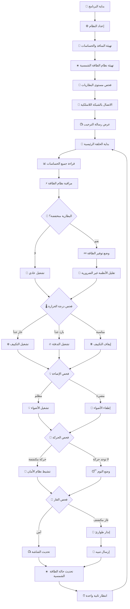
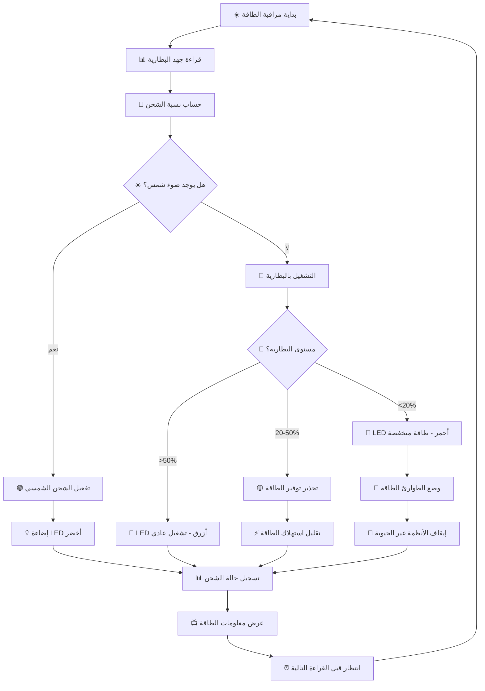
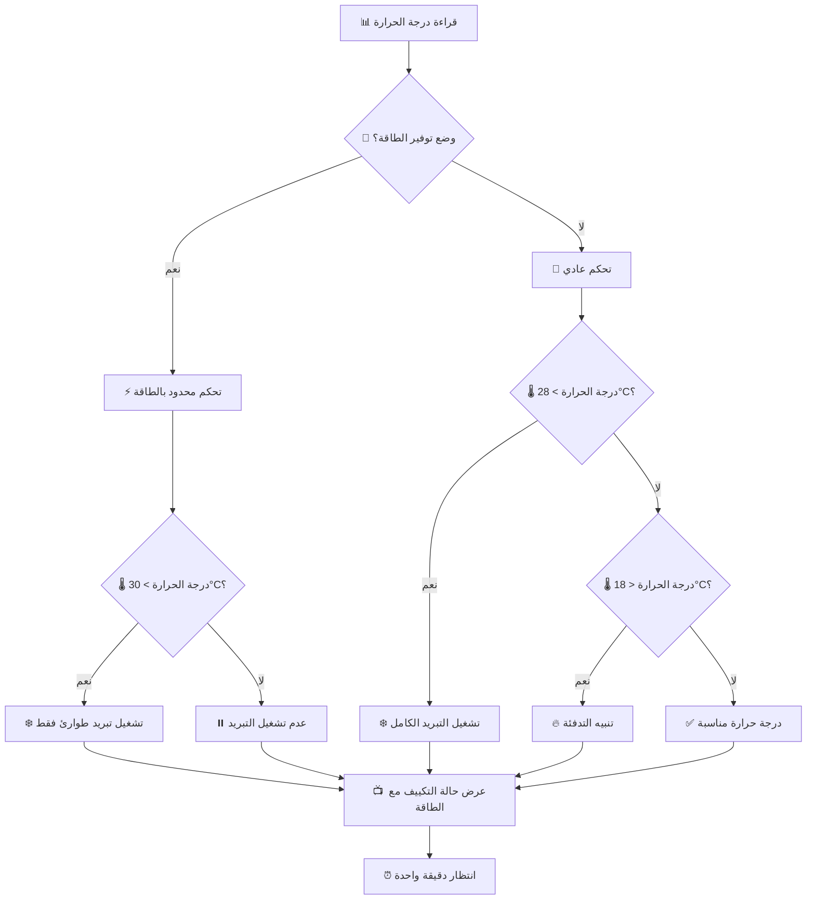
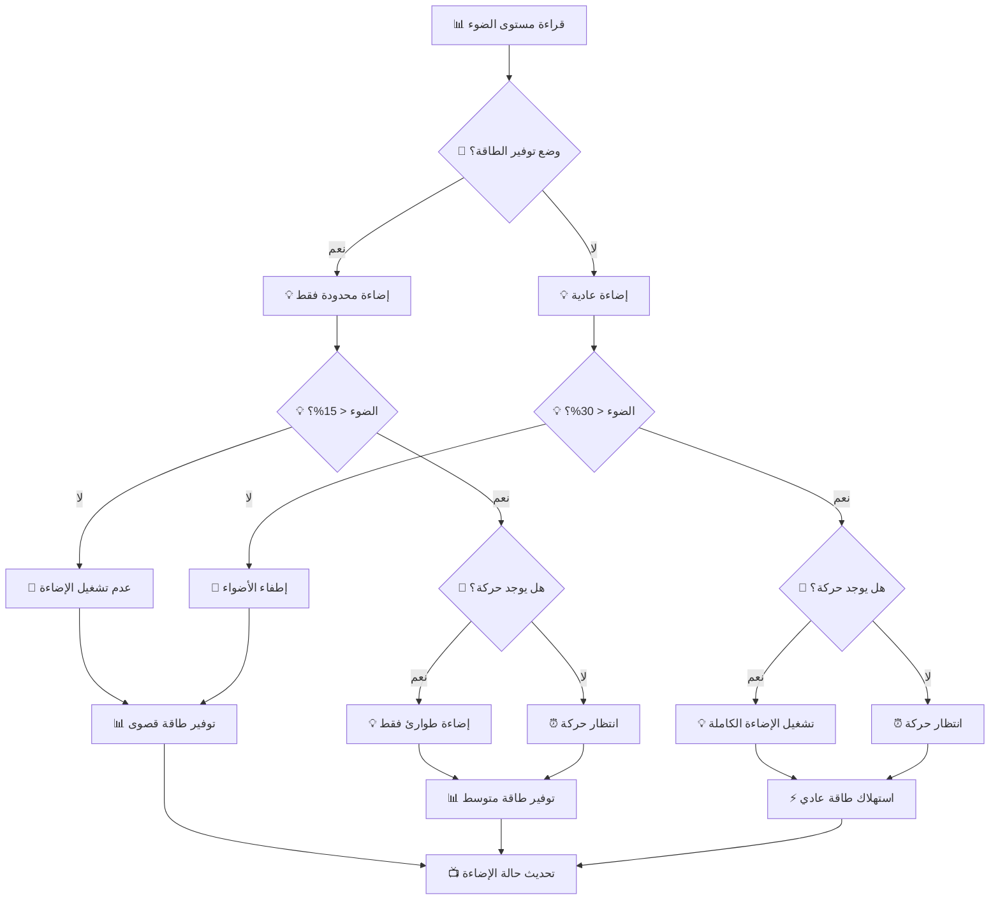
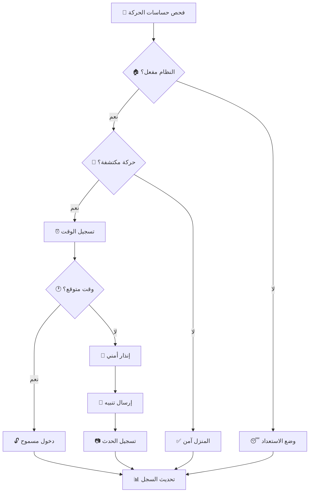
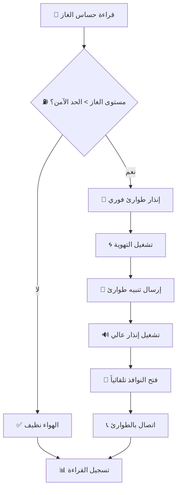
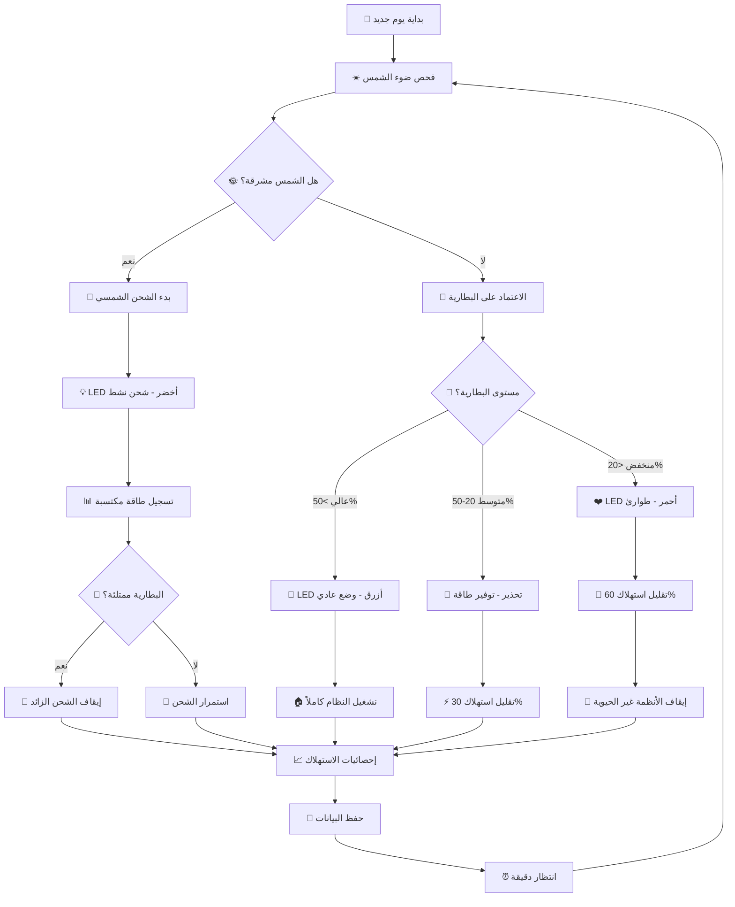
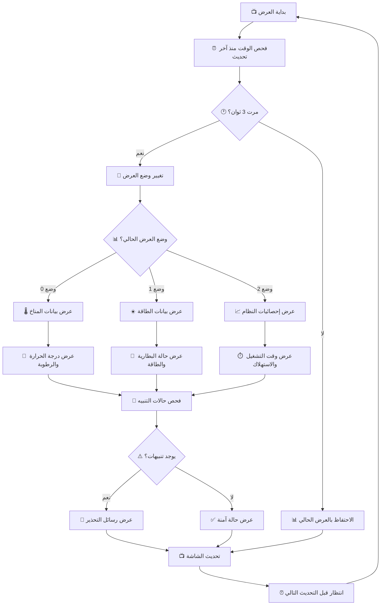

# 08 - مخطط تدفق البرنامج | Code Flowchart

## 📚 المقدمة والأهداف التعليمية

### 🎯 ما ستتعلمه في هذا الفصل:
1. **💭 التفكير المنطقي**: كيفية تحليل المشاكل وحلها خطوة بخطوة
2. **🔄 مفهوم الخوارزميات**: تسلسل العمليات لتحقيق هدف محدد
3. **📊 التمثيل البصري**: استخدام المخططات لفهم منطق البرنامج
4. **🔧 الترجمة العملية**: تحويل الأفكار إلى كود قابل للتنفيذ
5. **⚡ إدارة الطاقة الذكية**: تحسين استهلاك الطاقة في الأنظمة المدمجة

### 🧠 المفاهيم الأساسية:

#### 1. ما هو مخطط التدفق (Flowchart)؟
مخطط التدفق هو رسم بياني يوضح خطوات حل مشكلة أو تنفيذ مهمة معينة. يستخدم رموزاً موحدة:
- 🟢 **الدائرة**: نقطة البداية والنهاية
- 📦 **المستطيل**: عملية أو إجراء
- 🔷 **المعين**: قرار أو شرط
- ➡️ **السهم**: اتجاه التدفق

#### 2. لماذا نستخدم مخططات التدفق؟
- **👀 الوضوح**: رؤية شاملة للنظام
- **🔍 اكتشاف الأخطاء**: تحديد المشاكل قبل البرمجة
- **📖 التوثيق**: شرح النظام للآخرين
- **🔄 التحسين**: تطوير الخوارزميات بصرياً

#### 3. الطاقة الشمسية في الأنظمة الذكية:
- **☀️ الاستدامة**: تقليل الاعتماد على الشبكة الكهربائية
- **💰 التوفير**: تكلفة تشغيل أقل على المدى الطويل
- **🌍 البيئة**: تقليل البصمة الكربونية
- **🔋 الاستقلالية**: عمل النظام حتى في انقطاع الكهرباء

### 🎮 من اللعب إلى الواقع:
هذا المشروع يحول **البرمجة من مفهوم مجرد إلى تطبيق عملي ممتع**!
- نبدأ بالبلوكات المرئية (مثل الألعاب) 🎯
- ننتقل إلى الكود الحقيقي (مثل المحترفين) 💻
- نطبق على أجهزة فعلية (مثل المهندسين) 🔧

---

## 🗺️ خريطة التعلم والمهارات

### 📈 مستويات التعلم:

#### المستوى الأول: الفهم 🟢
- فهم مفهوم البرمجة والأوامر
- التعرف على أنواع الحساسات والأجهزة
- فهم مبادئ الكهرباء الأساسية

#### المستوى الثاني: التطبيق 🟡 
- استخدام البلوكات المرئية في Tinkercad
- تجميع الدوائر الأساسية
- كتابة برامج بسيطة

#### المستوى الثالث: التحليل 🟠
- قراءة وفهم الكود المكتوب
- تحليل مخططات التدفق المعقدة
- حل المشاكل البرمجية

#### المستوى الرابع: الإبداع 🔴
- تطوير حلول مبتكرة
- دمج أنظمة متعددة
- إنشاء مشاريع شخصية

### 🛠️ الأدوات والمهارات المطلوبة:

#### أدوات البرمجة:
- **Tinkercad**: للمحاكاة والبلوكات المرئية
- **Arduino IDE**: لكتابة وتحميل الكود
- **Serial Monitor**: لمراقبة وتشخيص البرنامج

#### المهارات الأساسية:
- **المنطق الرياضي**: فهم الشروط والحلقات
- **حل المشاكل**: تحليل وإصلاح الأخطاء  
- **التفكير النقدي**: تحسين وتطوير الحلول

#### المفاهيم الكهربائية:
- **الجهد والتيار**: الوحدات الأساسية
- **المقاومة**: تحديد قيم المقاومات
- **الدوائر**: التوصيل على التوالي والتوازي

### 🎯 أهداف هذا الفصل التفصيلية:

1. **تصميم منطق النظام** 🧩
   - رسم مخطط تدفق شامل
   - تحديد نقاط القرار الحاسمة
   - ربط الأجزاء المختلفة للنظام

2. **فهم إدارة الطاقة** ⚡
   - حساب استهلاك الطاقة
   - تحسين كفاءة النظام
   - برمجة أنظمة التوفير الذكية

3. **تطبيق مفاهيم الأمان** 🛡️
   - برمجة أنظمة الإنذار
   - إدارة حالات الطوارئ
   - التحقق من صحة البيانات

4. **التكامل مع الإنترنت** 🌐
   - إرسال البيانات للسحابة
   - المراقبة عن بُعد
   - التحديثات الآمنة

---

## رحلة الكود: من البلوكات المرئية إلى Arduino C++ 🎮➡️💻

### 🌟 النهج المبتكر: من Tinkercad إلى ESP32
هذا المخطط يمثل النسخة المُترجمة والمُحسَّنة من البرمجة بالبلوكات المرئية في Tinkercad إلى كود Arduino C++ متقدم!

### 🚀 مميزات التطوير الجديد:
- ✅ **كود مُختبر مسبقاً**: تم تشغيله بنجاح في المحاكاة
- ✅ **منطق مضمون**: خوارزميات تم اختبارها بصرياً
- ✅ **بنية واضحة**: ترجمة مباشرة من البلوكات المفهومة
- ✅ **تحسينات ESP32**: استغلال مميزات WiFi والبلوتوث
- ✅ **أمان مدمج**: فحص الأخطاء وحالات الطوارئ

### 🎯 خريطة التطوير:
1. **المحاكاة في Tinkercad**: بلوكات مرئية بسيطة
2. **التصدير**: كود Arduino C++ أساسي
3. **التطوير**: إضافة مميزات ESP32 المتقدمة
4. **التحسين**: تحسين الأداء والكفاءة
5. **التطبيق**: نقل للجهاز الفعلي

---

## 🎮 التطبيق العملي في Tinkercad | Practical Implementation

### 📋 المرحلة الأولى: إعداد المشروع في Tinkercad

#### 🚀 خطوات البداية:

1. **إنشاء مشروع جديد** 🆕
   - اذهب إلى [tinkercad.autodesk.com](https://tinkercad.autodesk.com)
   - اضغط على "Create new Circuit"
   - اختر اسم المشروع: "Smart Eco Home"

2. **إضافة اللوحة الرئيسية** 🔧
   - ابحث عن "Arduino Uno R3" في مكتبة المكونات
   - اسحبه إلى منطقة العمل
   - ضعه في المنتصف كنقطة مرجعية

### 🔌 المرحلة الثانية: توصيل المكونات الأساسية

#### 1. توصيل حساسات الحركة (PIR) 👥

```
مكونات مطلوبة:
- 2x PIR Motion Sensor
- أسلاك توصيل

التوصيل:
PIR Sensor 1:
- VCC → 5V على Arduino
- GND → GND على Arduino  
- OUT → Pin 2 على Arduino

PIR Sensor 2:
- VCC → 5V على Arduino
- GND → GND على Arduino
- OUT → Pin 3 على Arduino
```

**خطوات التوصيل في Tinkercad:**
1. ابحث عن "PIR" في مكتبة المكونات
2. اسحب حساسين إلى منطقة العمل
3. اضغط على نقطة VCC الحمراء واسحب سلك إلى 5V
4. اضغط على نقطة GND السوداء واسحب سلك إلى GND
5. اضغط على نقطة OUT واسحب سلك إلى Pin 2 (للأول) وPin 3 (للثاني)

#### 2. توصيل حساسات الضوء (LDR) 💡

```
مكونات مطلوبة:
- 2x Photoresistor (LDR)
- 2x 10kΩ Resistor
- أسلاك توصيل

التوصيل (مقسم الجهد):
LDR 1:
- طرف واحد → 5V
- الطرف الآخر → A0 + مقاومة 10kΩ إلى GND

LDR 2:
- طرف واحد → 5V  
- الطرف الآخر → A1 + مقاومة 10kΩ إلى GND
```

**خطوات التوصيل في Tinkercad:**
1. ابحث عن "Photoresistor" في المكونات
2. ابحث عن "Resistor" واختر 10kΩ
3. اسحب 2 من كل نوع إلى منطقة العمل
4. وصل LDR1 بين 5V وPin A0
5. وصل مقاومة 10kΩ بين A0 وGND
6. كرر نفس الخطوات للـ LDR2 مع Pin A1

#### 3. توصيل حساس الحرارة والرطوبة (DHT22) 🌡️

```
مكونات مطلوبة:
- 1x DHT22 Temperature & Humidity Sensor
- 1x 4.7kΩ Resistor (pull-up)

التوصيل:
DHT22:
- VCC → 3.3V على Arduino
- GND → GND على Arduino
- Data → Pin 4 + مقاومة 4.7kΩ إلى VCC
```

#### 4. توصيل المخرجات (LEDs, Buzzer, Fan) 🔊

```
LEDs (الإضاءة):
LED 1: Pin 8 → مقاومة 220Ω → LED → GND
LED 2: Pin 9 → مقاومة 220Ω → LED → GND

Buzzer (الإنذار):
Buzzer: Pin 10 → Buzzer → GND

Fan (التهوية):
Fan: Pin 11 → Fan Module → GND, VCC to 5V
```

#### 5. توصيل الشاشة LCD 📺

```
LCD 16x2:
- VSS → GND
- VDD → 5V  
- V0 → Potentiometer (للتحكم في السطوع)
- RS → Pin 12
- Enable → Pin 13
- D4 → Pin 7
- D5 → Pin 6  
- D6 → Pin 5
- D7 → Pin 4
```

### 🧩 المرحلة الثالثة: البرمجة بالبلوكات المرئية

#### 🎯 الهدف: إنشاء المنطق الأساسي باستخدام Code Blocks

#### 1. بلوك الإعداد الأساسي (Setup Block) ⚙️

```
في قسم البلوكات، اختر "Code Blocks":

🟦 [Setup Block]
├── 🔧 set LED pin 8 to OUTPUT
├── 🔧 set LED pin 9 to OUTPUT  
├── 🔧 set Buzzer pin 10 to OUTPUT
├── 🔧 set Fan pin 11 to OUTPUT
├── 🔧 set PIR pin 2 to INPUT
├── 🔧 set PIR pin 3 to INPUT
└── 📺 print "Smart Home Started!" to Serial Monitor
```

**خطوات التنفيذ:**
1. اضغط على "Code" أعلى يمين الشاشة
2. اختر "Blocks + Text" 
3. من قائمة "Control" اسحب "Setup" block
4. من "Input/Output" اسحب "set pin" blocks
5. غير الأرقام حسب التوصيلات أعلاه

#### 2. بلوك الحلقة الرئيسية (Main Loop) 🔄

```
🟩 [Forever Loop Block]
├── 📊 read PIR sensor on pin 2 → store in "motion1"
├── 📊 read PIR sensor on pin 3 → store in "motion2"  
├── 📊 read analog pin A0 → store in "light1"
├── 📊 read analog pin A1 → store in "light2"
├── 🧠 [IF Block] motion1 = HIGH
│   └── 💡 turn ON LED on pin 8
├── 🧠 [ELSE Block]  
│   └── 💡 turn OFF LED on pin 8
├── 🧠 [IF Block] light1 < 500
│   └── 💡 turn ON LED on pin 8
├── 🧠 [ELSE Block]
│   └── 💡 turn OFF LED on pin 8
└── ⏰ wait 1 second
```

#### 3. بناء منطق التحكم الذكي 🤖

##### أ) منطق الإضاءة الذكية:

```
🧠 [IF-ELSE Block Tree]
IF (light_level < 30% AND motion_detected)
├── 💡 turn ON lights
├── 📺 display "Lights ON - Motion detected"
ELSE IF (light_level > 70%)  
├── 💡 turn OFF lights
├── 📺 display "Lights OFF - Bright enough"
ELSE
├── 💡 keep current state
└── 📺 display "Standby mode"
```

##### ب) منطق التحكم في درجة الحرارة:

```
📊 temperature = read DHT22 sensor

🧠 [IF-ELSE Block Tree]
IF (temperature > 28°C)
├── 🌀 turn ON fan
├── 📺 display "Cooling activated"
ELSE IF (temperature < 18°C)
├── 🌀 turn OFF fan  
├── 📺 display "Heating needed"
ELSE
├── 🌀 turn OFF fan
└── 📺 display "Temperature OK"
```

##### ج) نظام الأمان والإنذار:

```
🧠 [IF Block] 
IF (motion_detected AND security_mode_ON)
├── 🚨 turn ON buzzer for 3 seconds
├── 💡 blink LEDs 5 times
├── 📺 display "ALERT! Motion detected"
└── 📱 send notification (simulation)
```

### 🔄 المرحلة الرابعة: المحاكاة والاختبار

#### 🎮 تشغيل المحاكاة:

1. **اضغط على زر "Start Simulation"** ▶️
2. **تفاعل مع الحساسات:**
   - اضغط على PIR sensors لمحاكاة الحركة
   - اضغط على LDRs لتغيير مستوى الضوء
   - استخدم شريط التمرير للـ DHT22 لتغيير درجة الحرارة

3. **مراقبة النتائج:**
   - راقب إضاءة وإطفاء LEDs
   - استمع لصوت Buzzer عند التنبيه
   - راقب حركة Fan عند تشغيل التبريد

#### 🐛 اختبار وإصلاح الأخطاء:

##### ✅ اختبارات أساسية:
- **اختبار الإضاءة**: حرك PIR → LED يجب أن يضيء
- **اختبار الحرارة**: غير درجة الحرارة → Fan يجب أن يعمل/يتوقف
- **اختبار الأمان**: حرك PIR مع تفعيل الأمان → Buzzer يصدر صوت

##### 🔧 حل المشاكل الشائعة:
1. **LED لا يضيء**: تحقق من توصيل المقاومة والقطبية
2. **PIR لا يستجيب**: تحقق من توصيل VCC وGND
3. **Buzzer لا يصدر صوت**: تحقق من القطبية والتوصيل

### 📤 المرحلة الخامسة: تصدير الكود

#### 🔄 من البلوكات إلى كود Arduino:

1. **عرض الكود المُولد تلقائياً:**
   - اضغط على "Blocks + Text" في أعلى يمين نافذة الكود
   - اختر "Text" لرؤية كود Arduino C++

2. **نسخ الكود الأساسي:**
```cpp
// الكود المُولد من Tinkercad
void setup() {
  Serial.begin(9600);
  pinMode(8, OUTPUT);  // LED 1
  pinMode(9, OUTPUT);  // LED 2
  pinMode(10, OUTPUT); // Buzzer
  pinMode(11, OUTPUT); // Fan
  pinMode(2, INPUT);   // PIR 1
  pinMode(3, INPUT);   // PIR 2
  Serial.println("Smart Home Started!");
}

void loop() {
  int motion1 = digitalRead(2);
  int motion2 = digitalRead(3);
  int light1 = analogRead(A0);
  int light2 = analogRead(A1);
  
  // منطق الإضاءة
  if (motion1 == HIGH && light1 < 500) {
    digitalWrite(8, HIGH);
  } else {
    digitalWrite(8, LOW);
  }
  
  if (motion2 == HIGH && light2 < 500) {
    digitalWrite(9, HIGH);  
  } else {
    digitalWrite(9, LOW);
  }
  
  delay(1000);
}
```

3. **حفظ وتصدير المشروع:**
   - اضغط على اسم المشروع أعلى الشاشة
   - اختر "Download for Arduino IDE"
   - احفظ الملف لاستخدامه مع ESP32 لاحقاً

### 🎓 نصائح مهمة للتطبيق في Tinkercad:

#### ✅ أفضل الممارسات:
1. **ابدأ بسيط**: اختبر كل حساس منفرداً أولاً
2. **استخدم Serial Monitor**: لمراقبة قيم الحساسات
3. **اختبر خطوة بخطوة**: أضف مكون واحد في كل مرة
4. **استخدم التعليقات**: اكتب ملاحظات في الكود

#### 🚫 أخطاء شائعة يجب تجنبها:
1. **عدم استخدام مقاومات Pull-up/Pull-down**
2. **توصيل VCC مع GND (دائرة قصيرة)**  
3. **تجاهل قطبية LEDs والبطاريات**
4. **استخدام أرقام pins خاطئة في الكود**

#### 🔧 أدوات مساعدة في Tinkercad:
- **Multimeter**: لقياس الجهد والتيار
- **Oscilloscope**: لمراقبة الإشارات الرقمية
- **Function Generator**: لتوليد إشارات اختبار

### 🚀 الانتقال إلى المستوى التالي:

بعد إتقان الأساسيات في Tinkercad، ستكون جاهزاً للانتقال إلى:
1. **Arduino IDE**: لبرمجة أكثر تقدماً
2. **ESP32**: لإضافة WiFi والميزات المتقدمة  
3. **أجهزة حقيقية**: للتطبيق العملي النهائي

### ☀️ إضافة نظام الطاقة الشمسية في Tinkercad

#### 🔋 المرحلة المتقدمة: تصميم نظام الطاقة البديلة

لأن Tinkercad لا يحتوي على مكونات طاقة شمسية جاهزة، سنمحاكي النظام بطريقة ذكية:

#### 1. محاكاة اللوح الشمسي 🌞

```
مكونات المحاكاة:
- 1x Potentiometer (لمحاكاة كمية الضوء)
- 1x Voltage Divider Circuit
- 1x LED (مؤشر الطاقة الشمسية)

التوصيل:
Potentiometer (محاكاة اللوح الشمسي):
- الطرف الأول → 5V
- الطرف الثالث → GND  
- الطرف الأوسط → Pin A2 (قراءة "الطاقة الشمسية")
```

#### 2. محاكاة البطارية والشحن 🔋

```
مكونات إضافية:
- 1x Potentiometer (لمحاكاة مستوى البطارية)
- 3x LEDs (مؤشرات البطارية: أخضر، أصفر، أحمر)
- 3x 220Ω Resistors

التوصيل:
Battery Level Potentiometer:
- الطرف الأول → 5V
- الطرف الثالث → GND
- الطرف الأوسط → Pin A3 (قراءة مستوى البطارية)

مؤشرات البطارية:
- LED أخضر → Pin 5 (بطارية جيدة)
- LED أصفر → Pin 6 (بطارية متوسطة)  
- LED أحمر → Pin 7 (بطارية منخفضة)
```

#### 3. البلوكات للطاقة الشمسية ⚡

```
🟦 [Setup Block - إضافة للطاقة]
├── 🔧 set Green LED pin 5 to OUTPUT    // مؤشر بطارية جيدة
├── 🔧 set Yellow LED pin 6 to OUTPUT   // مؤشر بطارية متوسطة
├── 🔧 set Red LED pin 7 to OUTPUT      // مؤشر بطارية منخفضة
└── 📺 print "Solar Power System Ready!" to Serial Monitor

🟩 [Forever Loop Block - إضافة الطاقة]
├── 📊 read analog pin A2 → store in "solar_power"
├── 📊 read analog pin A3 → store in "battery_level"
├── 🧮 convert solar_power to percentage → "solar_percent"
├── 🧮 convert battery_level to percentage → "battery_percent"
├── 
├── 🧠 [IF Block] battery_percent > 70
│   ├── 💡 turn ON Green LED (pin 5)
│   ├── 💡 turn OFF Yellow LED (pin 6)  
│   ├── 💡 turn OFF Red LED (pin 7)
│   └── 📺 display "Battery: GOOD"
├── 
├── 🧠 [ELSE IF Block] battery_percent > 30
│   ├── 💡 turn OFF Green LED (pin 5)
│   ├── 💡 turn ON Yellow LED (pin 6)
│   ├── 💡 turn OFF Red LED (pin 7)
│   └── 📺 display "Battery: MEDIUM" 
├──
├── 🧠 [ELSE Block] battery_percent <= 30
│   ├── 💡 turn OFF Green LED (pin 5)
│   ├── 💡 turn OFF Yellow LED (pin 6)
│   ├── 💡 turn ON Red LED (pin 7)
│   └── 📺 display "Battery: LOW!"
└──
└── 🧠 [IF Block] solar_percent > 50
    ├── 📺 display "Solar charging active"
    └── 💡 blink Green LED (simulate charging)
```

#### 4. كود الطاقة الشمسية المُولد 🔌

```cpp
// إضافات للكود الأساسي
void setup() {
  Serial.begin(9600);
  
  // إعداد أطراف الطاقة الشمسية
  pinMode(5, OUTPUT);  // LED أخضر - بطارية جيدة
  pinMode(6, OUTPUT);  // LED أصفر - بطارية متوسطة  
  pinMode(7, OUTPUT);  // LED أحمر - بطارية منخفضة
  
  Serial.println("Smart Home with Solar Power Started!");
}

void loop() {
  // قراءة الحساسات الأساسية
  int motion1 = digitalRead(2);
  int motion2 = digitalRead(3);
  int light1 = analogRead(A0);
  int light2 = analogRead(A1);
  
  // قراءة نظام الطاقة الشمسية
  int solar_power = analogRead(A2);      // محاكاة اللوح الشمسي
  int battery_level = analogRead(A3);    // محاكاة مستوى البطارية
  
  // تحويل إلى نسب مئوية
  int solar_percent = map(solar_power, 0, 1023, 0, 100);
  int battery_percent = map(battery_level, 0, 1023, 0, 100);
  
  // إدارة مؤشرات البطارية
  manageBatteryIndicators(battery_percent);
  
  // إدارة الطاقة الذكية
  smartPowerManagement(battery_percent, solar_percent);
  
  // عرض معلومات الطاقة
  displayPowerInfo(battery_percent, solar_percent);
  
  delay(1000);
}

void manageBatteryIndicators(int battery_percent) {
  // إطفاء جميع المؤشرات أولاً
  digitalWrite(5, LOW);
  digitalWrite(6, LOW);  
  digitalWrite(7, LOW);
  
  if (battery_percent > 70) {
    digitalWrite(5, HIGH);  // LED أخضر
  } else if (battery_percent > 30) {
    digitalWrite(6, HIGH);  // LED أصفر
  } else {
    digitalWrite(7, HIGH);  // LED أحمر
  }
}

void smartPowerManagement(int battery_percent, int solar_percent) {
  // في حالة البطارية المنخفضة
  if (battery_percent < 30) {
    Serial.println("⚠️ وضع توفير الطاقة مُفعل");
    
    // إطفاء الإضاءة غير الضرورية
    if (digitalRead(2) == LOW) {  // لا توجد حركة
      digitalWrite(8, LOW);       // إطفاء LED 1
    }
    if (digitalRead(3) == LOW) {  // لا توجد حركة
      digitalWrite(9, LOW);       // إطفاء LED 2  
    }
  }
  
  // في حالة الشحن الشمسي النشط
  if (solar_percent > 50) {
    Serial.println("☀️ الشحن الشمسي نشط");
    
    // محاكاة الشحن برمش LED أخضر
    static unsigned long lastBlink = 0;
    if (millis() - lastBlink > 500) {
      lastBlink = millis();
      digitalWrite(5, !digitalRead(5));
    }
  }
}

void displayPowerInfo(int battery_percent, int solar_percent) {
  Serial.print("🔋 البطارية: ");
  Serial.print(battery_percent);
  Serial.print("% | ☀️ الطاقة الشمسية: ");
  Serial.print(solar_percent);
  Serial.println("%");
}
```

#### 5. تجارب متقدمة في Tinkercad 🧪

##### تجربة 1: سيناريو يوم مشمس
```
الخطوات:
1. ارفع قيمة Potentiometer الطاقة الشمسية إلى 80%
2. ابدأ بمستوى بطارية منخفض (30%)
3. راقب كيف يتم "شحن" البطارية تدريجياً
4. لاحظ تغير مؤشرات LED من أحمر إلى أصفر إلى أخضر
```

##### تجربة 2: سيناريو يوم غائم
```
الخطوات:  
1. اخفض قيمة Potentiometer الطاقة الشمسية إلى 20%
2. ابدأ بمستوى بطارية عالي (80%)
3. راقب كيف تنخفض البطارية تدريجياً
4. لاحظ تفعيل وضع توفير الطاقة عند الوصول لـ 30%
```

##### تجربة 3: إدارة الطوارئ
```
الخطوات:
1. اجعل الطاقة الشمسية = 0% (ليل)
2. اخفض البطارية إلى أقل من 20%
3. حرك PIR sensors لمحاكاة الحركة
4. راقب كيف يعطي النظام أولوية للأمان رغم قلة الطاقة
```

#### 6. قائمة فحص للتطبيق الكامل ✅

##### المكونات الأساسية:
- [ ] Arduino Uno R3
- [ ] 2x PIR Motion Sensors  
- [ ] 2x Photoresistors (LDR)
- [ ] 1x DHT22 (أو DHT11)
- [ ] 2x LEDs للإضاءة
- [ ] 1x Buzzer
- [ ] 1x Fan Motor
- [ ] 1x LCD 16x2

##### مكونات الطاقة الشمسية:
- [ ] 2x Potentiometers (محاكاة)
- [ ] 3x LEDs للمؤشرات
- [ ] مقاومات مختلفة
- [ ] أسلاك توصيل كافية

##### اختبارات وظيفية:
- [ ] إضاءة تلقائية مع الحركة
- [ ] تحكم في درجة الحرارة
- [ ] نظام أمان بالإنذار
- [ ] مؤشرات البطارية تعمل
- [ ] وضع توفير الطاقة يتفعل
- [ ] محاكاة الشحن الشمسي

### 📚 مصادر إضافية للتعلم:

1. **قناة Tinkercad الرسمية**: [youtube.com/tinkercad](https://youtube.com/tinkercad)
2. **دروس Arduino**: [arduino.cc/en/Tutorial](https://arduino.cc/en/Tutorial)  
3. **مشاريع IoT**: [hackster.io](https://hackster.io)

---

## هيكل البرنامج العام مع نظام الطاقة الشمسية 📊☀️

### نظرة شاملة على منطق التشغيل المحدث 🔄



## تفصيل مراحل البرنامج المحدث 🔍

### المرحلة 1: إعداد النظام مع الطاقة الشمسية (Setup Phase) ⚙️☀️

```cpp
void setup() {
    // 1. تهيئة التواصل التسلسلي
    Serial.begin(115200);
    Serial.println("🏠☀️ مرحباً بكم في البيت الذكي البيئي!");
    
    // 2. إعداد منافذ الإدخال
    pinMode(PIR_PIN_1, INPUT);      // حساس الحركة 1
    pinMode(PIR_PIN_2, INPUT);      // حساس الحركة 2
    pinMode(LDR_PIN_1, INPUT);      // حساس الضوء 1
    pinMode(LDR_PIN_2, INPUT);      // حساس الضوء 2
    pinMode(GAS_PIN, INPUT);        // حساس الغاز
    pinMode(VOLTAGE_SENSOR_PIN, INPUT); // حساس مستوى البطارية
    
    // 3. إعداد منافذ الإخراج
    pinMode(LED_PIN_1, OUTPUT);     // مصباح 1
    pinMode(LED_PIN_2, OUTPUT);     // مصباح 2
    pinMode(BUZZER_PIN, OUTPUT);    // جهاز الإنذار
    pinMode(FAN_PIN, OUTPUT);       // المروحة
    
    // 4. إعداد مؤشرات نظام الطاقة الشمسية
    pinMode(SOLAR_LED_PIN, OUTPUT);    // مؤشر الطاقة الشمسية
    pinMode(BATTERY_LED_PIN, OUTPUT);  // مؤشر البطارية المنخفضة
    pinMode(SYSTEM_LED_PIN, OUTPUT);   // مؤشر حالة النظام
    
    // 5. تهيئة الحساسات
    dht.begin();                    // حساس الحرارة
    lcd.init();                     // الشاشة
    servo1.attach(SERVO_PIN_1);     // محرك 1
    servo2.attach(SERVO_PIN_2);     // محرك 2
    
    // 6. تهيئة نظام الطاقة الشمسية
    initializePowerSystem();
    
    // 7. الاتصال بالواي فاي
    connectToWiFi();
    
    // 8. اختبار جميع المكونات
    testAllComponents();
    
    Serial.println("✅ تم تشغيل النظام بنجاح مع الطاقة الشمسية!");
}
```

### المرحلة 2: الحلقة الرئيسية المحدثة (Main Loop) 🔄

```cpp
void loop() {
    // قراءة جميع الحساسات
    readAllSensors();
    
    // مراقبة وإدارة نظام الطاقة الشمسية (أولوية عليا)
    readBatteryStatus();
    processPowerManagement();
    
    // تحليل البيانات واتخاذ القرارات
    processTemperatureControl();
    processLightingControl();
    processSecuritySystem();
    processGasDetection();
    
    // تحديث المعلومات المعروضة
    updateDisplay();
    
    // إرسال البيانات عبر الشبكة
    sendDataToCloud();
    
    // تسجيل بيانات الطاقة الشمسية
    solarDataLogging();
    
    // انتظار قبل القراءة التالية
    delay(1000);
}
```

## خوارزميات الأنظمة الفرعية المحدثة 🧠

### 1. نظام الطاقة الشمسية وإدارة البطاريات ☀️🔋



**الكود المقابل:**
```cpp
void processPowerManagement() {
    // قراءة جهد البطارية
    readBatteryStatus();
    
    // إدارة مؤشرات LED للطاقة
    if (homeStatus.solarCharging) {
        // الطاقة الشمسية متوفرة - LED أخضر
        digitalWrite(SOLAR_LED_PIN, HIGH);
        digitalWrite(BATTERY_LED_PIN, LOW);
        digitalWrite(SYSTEM_LED_PIN, LOW);
        homeStatus.powerSource = "شمسي";
        
    } else if (homeStatus.batteryPercentage > 20) {
        // يعمل بالبطارية - LED أزرق
        digitalWrite(SYSTEM_LED_PIN, HIGH);
        digitalWrite(BATTERY_LED_PIN, LOW);
        digitalWrite(SOLAR_LED_PIN, LOW);
        homeStatus.powerSource = "بطارية";
        
    } else {
        // بطارية منخفضة - LED أحمر يرمش
        static unsigned long lastBlink = 0;
        if (millis() - lastBlink > 500) {
            lastBlink = millis();
            digitalWrite(BATTERY_LED_PIN, !digitalRead(BATTERY_LED_PIN));
        }
        digitalWrite(SOLAR_LED_PIN, LOW);
        digitalWrite(SYSTEM_LED_PIN, LOW);
        homeStatus.powerSource = "طوارئ";
    }
    
    // تفعيل وضع توفير الطاقة عند الحاجة
    if (homeStatus.lowBattery) {
        energySavingMode();
    }
}

void readBatteryStatus() {
    // قراءة جهد البطارية عبر مقسم الجهد
    int voltageReading = analogRead(VOLTAGE_SENSOR_PIN);
    homeStatus.batteryVoltage = (voltageReading * 3.3 / 4095) * 2.0;
    
    // حساب نسبة الشحن (16.8V = 100%, 12.4V = 0%)
    homeStatus.batteryPercentage = map(homeStatus.batteryVoltage * 100, 1240, 1680, 0, 100);
    homeStatus.batteryPercentage = constrain(homeStatus.batteryPercentage, 0, 100);
    
    // تحديد حالة البطارية
    homeStatus.lowBattery = (homeStatus.batteryPercentage < 20);
    homeStatus.solarCharging = (homeStatus.batteryVoltage > 15.5);
}

void energySavingMode() {
    static bool energyModeActive = false;
    
    if (!energyModeActive) {
        energyModeActive = true;
        Serial.println("🔋 تفعيل وضع توفير الطاقة!");
        
        // تقليل سطوع الإضاءة أو إيقافها
        digitalWrite(LED_PIN_1, LOW);
        digitalWrite(LED_PIN_2, LOW);
        
        // إيقاف المراوح غير الضرورية
        if (!homeStatus.gasAlert) {
            digitalWrite(FAN_PIN, LOW);
        }
    }
    
    // إنذار البطارية المنخفضة
    static unsigned long lastWarning = 0;
    if (millis() - lastWarning > 30000) {
        lastWarning = millis();
        lowBatteryAlert();
    }
}
```

### 2. نظام التحكم في درجة الحرارة مع إدارة الطاقة 🌡️



**الكود المحدث:**
```cpp
void processTemperatureControl() {
    float temperature = dht.readTemperature();
    
    if (!isnan(temperature)) {
        // فحص وضع توفير الطاقة أولاً
        if (homeStatus.lowBattery) {
            // في وضع توفير الطاقة - تبريد طوارئ فقط
            if (temperature > 30.0) {
                digitalWrite(FAN_PIN, HIGH);
                homeStatus.cooling = true;
                Serial.println("❄️ تبريد طوارئ - بطارية منخفضة");
            } else {
                digitalWrite(FAN_PIN, LOW);
                homeStatus.cooling = false;
            }
        } else {
            // تشغيل عادي
            if (temperature > TEMP_HIGH_THRESHOLD) {
                digitalWrite(FAN_PIN, HIGH);
                homeStatus.cooling = true;
                Serial.println("❄️ تم تشغيل التبريد");
                
            } else if (temperature < TEMP_LOW_THRESHOLD) {
                digitalWrite(FAN_PIN, LOW);
                homeStatus.cooling = false;
                homeStatus.needHeating = true;
                Serial.println("🔥 الحاجة إلى تدفئة");
                
            } else {
                digitalWrite(FAN_PIN, LOW);
                homeStatus.cooling = false;
                homeStatus.needHeating = false;
                Serial.println("✅ درجة حرارة مناسبة");
            }
        }
        
        homeStatus.temperature = temperature;
    }
}
```

### 3. نظام الإضاءة الذكية مع كفاءة الطاقة 💡



**الكود المحدث:**
```cpp
void processLightingControl() {
    int lightLevel1 = analogRead(LDR_PIN_1);
    int lightLevel2 = analogRead(LDR_PIN_2);
    bool motion1 = digitalRead(PIR_PIN_1);
    bool motion2 = digitalRead(PIR_PIN_2);
    
    // تحويل القراءة إلى نسبة مئوية
    int lightPercent1 = map(lightLevel1, 0, 4095, 0, 100);
    int lightPercent2 = map(lightLevel2, 0, 4095, 0, 100);
    
    // تحديد عتبة الإضاءة حسب حالة البطارية
    int lightThreshold = homeStatus.lowBattery ? 15 : LIGHT_THRESHOLD;
    
    // غرفة المعيشة
    if (homeStatus.lowBattery) {
        // في وضع توفير الطاقة - إضاءة محدودة فقط
        if (lightPercent1 < lightThreshold && motion1) {
            digitalWrite(LED_PIN_1, HIGH);
            homeStatus.light1 = true;
            Serial.println("💡 إضاءة طوارئ - غرفة المعيشة");
        } else {
            digitalWrite(LED_PIN_1, LOW);
            homeStatus.light1 = false;
        }
    } else {
        // تشغيل عادي
        if (lightPercent1 < lightThreshold && motion1) {
            digitalWrite(LED_PIN_1, HIGH);
            homeStatus.light1 = true;
            Serial.println("💡 تشغيل إضاءة غرفة المعيشة");
        } else {
            digitalWrite(LED_PIN_1, LOW);
            homeStatus.light1 = false;
        }
    }
    
    // المطبخ (نفس المنطق)
    if (homeStatus.lowBattery) {
        if (lightPercent2 < lightThreshold && motion2) {
            digitalWrite(LED_PIN_2, HIGH);
            homeStatus.light2 = true;
            Serial.println("💡 إضاءة طوارئ - المطبخ");
        } else {
            digitalWrite(LED_PIN_2, LOW);
            homeStatus.light2 = false;
        }
    } else {
        if (lightPercent2 < lightThreshold && motion2) {
            digitalWrite(LED_PIN_2, HIGH);
            homeStatus.light2 = true;
            Serial.println("💡 تشغيل إضاءة المطبخ");
        } else {
            digitalWrite(LED_PIN_2, LOW);
            homeStatus.light2 = false;
        }
    }
    
    homeStatus.lightLevel1 = lightPercent1;
    homeStatus.lightLevel2 = lightPercent2;
}
```

### 4. نظام الأمان والمراقبة 🔒



**الكود المقابل:**
```cpp
void processSecuritySystem() {
    bool motion1 = digitalRead(PIR_PIN_1);
    bool motion2 = digitalRead(PIR_PIN_2);
    
    if (securitySystem.enabled) {
        if (motion1 || motion2) {
            unsigned long currentTime = millis();
            
            // فحص إذا كان التنبيه الأخير منذ أكثر من 30 ثانية
            if (currentTime - securitySystem.lastAlert > 30000) {
                securitySystem.lastAlert = currentTime;
                securitySystem.alertCount++;
                
                // تشغيل الإنذار
                activateAlarm();
                
                // إرسال تنبيه
                sendSecurityAlert(motion1 ? "غرفة المعيشة" : "المدخل");
                
                Serial.println("🚨 تم اكتشاف حركة غير مصرح بها!");
            }
        }
    }
    
    currentStatus.motion1 = motion1;
    currentStatus.motion2 = motion2;
}

void activateAlarm() {
    // تشغيل الجرس لمدة 3 ثوان
    digitalWrite(BUZZER_PIN, HIGH);
    delay(3000);
    digitalWrite(BUZZER_PIN, LOW);
    
    // وميض الأضواء
    for (int i = 0; i < 5; i++) {
        digitalWrite(LED_PIN_1, HIGH);
        digitalWrite(LED_PIN_2, HIGH);
        delay(200);
        digitalWrite(LED_PIN_1, LOW);
        digitalWrite(LED_PIN_2, LOW);
        delay(200);
    }
}
```

### 5. نظام كشف الغاز والطوارئ ⛽



**الكود المقابل:**
```cpp
void processGasDetection() {
    int gasLevel = analogRead(GAS_PIN);
    int gasPercent = map(gasLevel, 0, 4095, 0, 100);
    
    if (gasPercent > GAS_DANGER_THRESHOLD) {
        // حالة طوارئ
        emergencyProtocol();
        Serial.println("🚨 خطر! تم اكتشاف غاز!");
        
    } else if (gasPercent > GAS_WARNING_THRESHOLD) {
        // تحذير
        warningProtocol();
        Serial.println("⚠️ تحذير: مستوى غاز مرتفع");
        
    } else {
        // الوضع طبيعي
        currentStatus.gasAlert = false;
        Serial.println("✅ جودة الهواء جيدة");
    }
    
    currentStatus.gasLevel = gasPercent;
}

void emergencyProtocol() {
    currentStatus.gasAlert = true;
    
    // تشغيل التهوية الكاملة
    digitalWrite(FAN_PIN, HIGH);
    
    // فتح النوافذ (محركات Servo)
    servo1.write(90);  // فتح النافذة 1
    servo2.write(90);  // فتح النافذة 2
    
    // إنذار طوارئ
    for (int i = 0; i < 10; i++) {
        digitalWrite(BUZZER_PIN, HIGH);
        delay(200);
        digitalWrite(BUZZER_PIN, LOW);
        delay(200);
    }
    
    // إرسال تنبيه طوارئ
    sendEmergencyAlert("Gas Detection Alert!");
}
```

## إدارة البيانات والذاكرة المحدثة 💾

### هيكل بيانات حالة النظام المحدث:

```cpp
struct SmartHomeStatus {
    // بيانات الحساسات
    float temperature;
    float humidity;
    int lightLevel1;
    int lightLevel2;
    int gasLevel;
    bool motion1;
    bool motion2;
    
    // حالة الأجهزة
    bool light1;
    bool light2;
    bool cooling;
    bool needHeating;
    bool gasAlert;
    
    // نظام الطاقة الشمسية الجديد ☀️🔋
    float batteryVoltage;
    int batteryPercentage;
    bool solarCharging;
    bool lowBattery;
    String powerSource;
    int powerConsumption;
    
    // إحصائيات
    unsigned long uptime;
    int alertCount;
    unsigned long lastUpdate;
    
    // عدادات توفير الطاقة
    unsigned long energySavingTime;
    int energySavingActivations;
};

SmartHomeStatus homeStatus;
```

### 6. نظام إدارة الطاقة المتجددة الشامل ⚡☀️



**الكود الشامل لإدارة الطاقة:**
```cpp
void comprehensivePowerManagement() {
    // قراءة جميع قيم الطاقة
    readAllPowerParameters();
    
    // تحديد استراتيجية الطاقة
    determinePowerStrategy();
    
    // تنفيذ استراتيجية الطاقة
    implementPowerStrategy();
    
    // تسجيل البيانات والإحصائيات
    logPowerData();
}

void readAllPowerParameters() {
    // قراءة جهد البطارية
    int voltageReading = analogRead(VOLTAGE_SENSOR_PIN);
    homeStatus.batteryVoltage = (voltageReading * 3.3 / 4095) * 2.0;
    
    // حساب نسبة الشحن
    homeStatus.batteryPercentage = map(homeStatus.batteryVoltage * 100, 1240, 1680, 0, 100);
    homeStatus.batteryPercentage = constrain(homeStatus.batteryPercentage, 0, 100);
    
    // تحديد حالة الشحن الشمسي
    homeStatus.solarCharging = (homeStatus.batteryVoltage > 15.5);
    homeStatus.lowBattery = (homeStatus.batteryPercentage < 20);
    
    // حساب الاستهلاك الحالي
    homeStatus.powerConsumption = calculateCurrentConsumption();
}

void determinePowerStrategy() {
    if (homeStatus.solarCharging && homeStatus.batteryPercentage > 80) {
        homeStatus.powerSource = "شمسي-ممتاز";
    } else if (homeStatus.solarCharging) {
        homeStatus.powerSource = "شمسي-شحن";
    } else if (homeStatus.batteryPercentage > 50) {
        homeStatus.powerSource = "بطارية-جيد";
    } else if (homeStatus.batteryPercentage > 20) {
        homeStatus.powerSource = "بطارية-متوسط";
    } else {
        homeStatus.powerSource = "بطارية-طوارئ";
    }
}

void implementPowerStrategy() {
    if (homeStatus.powerSource == "شمسي-ممتاز") {
        // وضع الأداء العالي
        fullPerformanceMode();
        digitalWrite(SOLAR_LED_PIN, HIGH);
        digitalWrite(BATTERY_LED_PIN, LOW);
        digitalWrite(SYSTEM_LED_PIN, LOW);
        
    } else if (homeStatus.powerSource == "شمسي-شحن") {
        // وضع الشحن النشط
        normalPerformanceMode();
        digitalWrite(SOLAR_LED_PIN, HIGH);
        digitalWrite(BATTERY_LED_PIN, LOW);
        digitalWrite(SYSTEM_LED_PIN, LOW);
        
    } else if (homeStatus.powerSource == "بطارية-جيد") {
        // وضع عادي بالبطارية
        normalPerformanceMode();
        digitalWrite(SYSTEM_LED_PIN, HIGH);
        digitalWrite(SOLAR_LED_PIN, LOW);
        digitalWrite(BATTERY_LED_PIN, LOW);
        
    } else if (homeStatus.powerSource == "بطارية-متوسط") {
        // وضع توفير طاقة خفيف
        moderateEnergySaving();
        blinkLED(SYSTEM_LED_PIN, 1000); // رمش كل ثانية
        
    } else {
        // وضع طوارئ
        emergencyEnergySaving();
        blinkLED(BATTERY_LED_PIN, 500); // رمش سريع
    }
}

int calculateCurrentConsumption() {
    int consumption = 50; // ESP32 base consumption
    
    if (homeStatus.light1) consumption += 20;
    if (homeStatus.light2) consumption += 20;  
    if (homeStatus.cooling) consumption += 150;
    if (digitalRead(BUZZER_PIN)) consumption += 30;
    if (lcd.getBacklight()) consumption += 10;
    
    return consumption;
}

void fullPerformanceMode() {
    // تشغيل جميع الأنظمة بأقصى كفاءة
    Serial.println("🚀 وضع الأداء العالي - طاقة شمسية ممتازة");
    // جميع الأنظمة مفعلة بدون قيود
}

void normalPerformanceMode() {
    // تشغيل عادي مع مراقبة
    Serial.println("⚡ وضع التشغيل العادي");
    // تشغيل الأنظمة حسب الحاجة
}

void moderateEnergySaving() {
    // توفير طاقة متوسط
    Serial.println("💡 وضع توفير الطاقة المتوسط");
    
    // تقليل سطوع الشاشة
    // إطفاء الإضاءة غير الضرورية
    if (!homeStatus.motion1) digitalWrite(LED_PIN_1, LOW);
    if (!homeStatus.motion2) digitalWrite(LED_PIN_2, LOW);
}

void emergencyEnergySaving() {
    // وضع الطوارئ - أقصى توفير
    Serial.println("🆘 وضع طوارئ - توفير طاقة قصوى");
    homeStatus.energySavingActivations++;
    
    // إيقاف جميع الأنظمة غير الحيوية
    digitalWrite(LED_PIN_1, LOW);
    digitalWrite(LED_PIN_2, LOW);
    
    // إيقاف التبريد إلا في حالات الطوارئ
    if (homeStatus.temperature < 32.0 && !homeStatus.gasAlert) {
        digitalWrite(FAN_PIN, LOW);
    }
    
    // تقليل تكرار القراءات
    delay(2000); // انتظار إضافي
}

void blinkLED(int pin, int interval) {
    static unsigned long lastBlink = 0;
    static bool ledState = false;
    
    if (millis() - lastBlink > interval) {
        lastBlink = millis();
        ledState = !ledState;
        digitalWrite(pin, ledState);
    }
}
```

### 7. نظام العرض الذكي مع معلومات الطاقة 📺



**الكود المحدث للعرض:**
```cpp
void updateSmartDisplay() {
    static int displayMode = 0;
    static unsigned long lastChange = 0;
    static int rotationSpeed = 3000; // 3 ثوان لكل وضع
    
    // تعديل سرعة التبديل حسب حالة الطاقة
    if (homeStatus.lowBattery) {
        rotationSpeed = 5000; // تبديل أبطأ لتوفير الطاقة
    }
    
    if (millis() - lastChange > rotationSpeed) {
        lastChange = millis();
        displayMode = (displayMode + 1) % 4; // 4 أوضاع عرض
    }
    
    lcd.clear();
    
    switch (displayMode) {
        case 0: // معلومات المناخ
            displayClimateInfo();
            break;
            
        case 1: // معلومات الطاقة الشمسية
            displaySolarPowerInfo();
            break;
            
        case 2: // إحصائيات النظام
            displaySystemStats();
            break;
            
        case 3: // معلومات الأمان والتنبيهات
            displaySecurityStatus();
            break;
    }
}

void displayClimateInfo() {
    lcd.setCursor(0, 0);
    lcd.print("T:");
    lcd.print(homeStatus.temperature, 1);
    lcd.print("C H:");
    lcd.print(homeStatus.humidity, 0);
    lcd.print("%");
    
    lcd.setCursor(0, 1);
    if (homeStatus.gasAlert) {
        lcd.print("⚠️ خطر! غاز مكتشف");
    } else if (homeStatus.motion1 || homeStatus.motion2) {
        lcd.print("👥 حركة مكتشفة");
    } else {
        lcd.print("✅ المناخ مناسب");
    }
}

void displaySolarPowerInfo() {
    lcd.setCursor(0, 0);
    lcd.print("☀️");
    lcd.print(homeStatus.powerSource);
    lcd.print(" ");
    lcd.print(homeStatus.batteryPercentage);
    lcd.print("%");
    
    lcd.setCursor(0, 1);
    lcd.print("🔋");
    lcd.print(homeStatus.batteryVoltage, 1);
    lcd.print("V ");
    
    if (homeStatus.solarCharging) {
        lcd.print("شحن");
    } else if (homeStatus.lowBattery) {
        lcd.print("منخفض!");
    } else {
        lcd.print("جيد");
    }
}

void displaySystemStats() {
    lcd.setCursor(0, 0);
    lcd.print("⏱️تشغيل:");
    lcd.print(homeStatus.uptime / 3600); // ساعات
    lcd.print("h ");
    lcd.print((homeStatus.uptime % 3600) / 60); // دقائق
    lcd.print("m");
    
    lcd.setCursor(0, 1);
    lcd.print("⚡استهلاك:");
    lcd.print(homeStatus.powerConsumption);
    lcd.print("mA");
}

void displaySecurityStatus() {
    lcd.setCursor(0, 0);
    if (homeStatus.gasAlert) {
        lcd.print("🚨 خطر غاز!");
    } else if (homeStatus.motion1 || homeStatus.motion2) {
        lcd.print("👁️ نشاط مكتشف");
    } else {
        lcd.print("🔒 النظام آمن");
    }
    
    lcd.setCursor(0, 1);
    lcd.print("توفير طاقة:");
    lcd.print(homeStatus.energySavingActivations);
    lcd.print("x");
}
```

## خوارزميات التحسين والتعلم الذكي 🤖

### نظام التعلم من الأنماط اليومية:

```cpp
void smartPatternLearning() {
    // تعلم أنماط الاستخدام اليومية
    static int hourlyUsage[24] = {0};
    static int dailyPowerGeneration[24] = {0};
    static int weatherPattern[7] = {0}; // أسبوعي
    
    int currentHour = hour();
    int currentDay = weekday();
    
    // تسجيل توليد الطاقة الشمسية
    if (homeStatus.solarCharging) {
        dailyPowerGeneration[currentHour]++;
    }
    
    // تسجيل أنماط الاستخدام
    if (homeStatus.motion1 || homeStatus.motion2) {
        hourlyUsage[currentHour]++;
    }
    
    // التنبؤ بالطقس حسب الأنماط
    if (dailyPowerGeneration[currentHour] > 10) {
        weatherPattern[currentDay] = 1; // يوم مشمس
    } else {
        weatherPattern[currentDay] = 0; // يوم غائم
    }
    
    // تعديل استراتيجية الطاقة حسب التعلم
    adaptPowerStrategy(hourlyUsage, dailyPowerGeneration);
}

void adaptPowerStrategy(int usage[], int generation[]) {
    int currentHour = hour();
    
    // إذا كان الاستخدام مرتفع في هذا الوقت
    if (usage[currentHour] > 5) {
        // احتفظ بطاقة إضافية
        if (homeStatus.batteryPercentage < 40) {
            Serial.println("🧠 تعلم ذكي: توفير طاقة استباقي");
            moderateEnergySaving();
        }
    }
    
    // إذا كان التوليد الشمسي ضعيف عادة في هذا الوقت
    if (generation[currentHour] < 2 && homeStatus.batteryPercentage < 60) {
        Serial.println("🧠 تنبؤ ذكي: شحن ضعيف متوقع");
        // بدء توفير الطاقة مبكراً
        moderateEnergySaving();
    }
}
```

## نصائح لتحسين الأداء مع الطاقة الشمسية ⚡

### 1. تحسين كفاءة الطاقة:
- استخدم `millis()` بدلاً من `delay()` لتوفير الطاقة
- اقرأ الحساسات بتكرار متغير حسب مستوى البطارية
- استخدم وضع Deep Sleep عند عدم النشاط الطويل

### 2. إدارة ذكية للبطارية:
- راقب دورات الشحن والتفريغ
- تجنب التفريغ العميق (أقل من 10%)
- استخدم نظام BMS للحماية من الشحن الزائد

### 3. تحسين النظام الشمسي:
- وجه الألواح نحو الشمس (جنوب في النصف الشمالي)
- حافظ على نظافة الألواح الشمسية
- راقب كفاءة التحويل والطاقة المفقودة

### 4. الموثوقية والأمان:
- أضف حماية من الدوائر القصيرة
- استخدم فيوزات للحماية من التيار الزائد
- راقب درجة حرارة البطاريات باستمرار

تذكروا: النظام الذكي هو الذي يتعلم ويتكيف مع البيئة المحيطة! 🌟🏠☀️ 